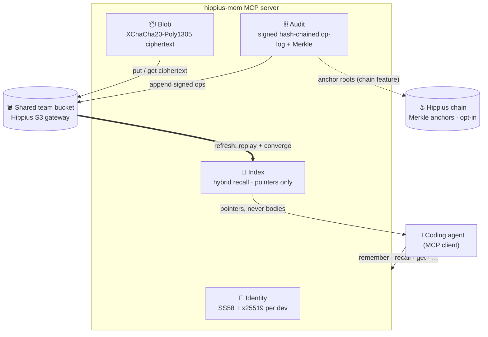
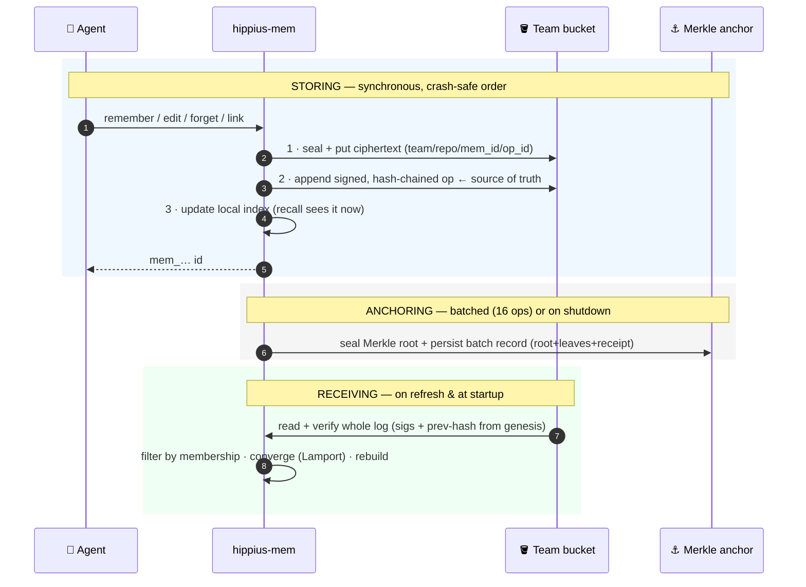

<div align="center">

# 🧠 Hippius Memory

**Shared, cross-machine memory for a team's coding agents — encrypted, verifiable, and context-efficient.**

[](https://www.rust-lang.org/)
[](https://doc.rust-lang.org/edition-guide/)
[](https://modelcontextprotocol.io/)
[](#configuration)
[](#phase-2--shared-op-log-convergence-and-verifiable-history)
[-success)](#scope-by-phase)

</div>

---

Hippius Memory is an **MCP server** that gives a team's coding agents shared,
cross-machine memory. Agents record notes — decisions, conventions, gotchas,
references, context — and manage them through **ten tools**
(`remember`, `recall`, `get`, `refresh`, `forget`, `redact`, `link`, `history`,
`reconcile`, `edit`). Notes are encrypted **client-side** and stored as objects on
the Hippius S3 gateway in one shared team bucket, with every mutation captured in a
**signed, hash-chained op-log**.

Because the bucket is the source of truth, any teammate's agent on any machine reads
the same memory — and because `recall` returns short pointers and summaries rather
than full bodies, an agent pulls **only what it needs** into its context window
instead of carrying the whole store.

> [!NOTE]
> **The default build is lexical; semantic recall is an opt-in.** A plain
> `cargo build --release` produces a lean binary that ranks `recall` with a
> deterministic bag-of-tokens hash embedder fused with keyword and recency scoring —
> no model, no download. Build `--features embeddings` and a real dense model
> (`bge-small-en-v1.5`, 384-dim, local ONNX) is used **by default within that build**,
> embedding query and summaries **in-process** — no text leaves the machine — so
> paraphrases match. Either way the privacy and no-external-service properties hold.
> See [Retrieval honesty](#retrieval-honesty).

<details>
<summary><b>📖 Table of contents</b></summary>

- [✨ Highlights](#highlights)
- [🏛 Architecture](#architecture)
- [🕰 How history is stored and received](#how-history-is-stored-and-received)
- [🚀 Quick start](#quick-start)
- [⚙️ Configuration](#configuration)
- [🛠 Operating model](#operating-model)
- [👥 Working as a team](#working-as-a-team)
- [🎯 Retrieval honesty](#retrieval-honesty)
- [🧰 MCP tools](#mcp-tools)
- [⛓ Phase 2 — op-log, convergence, verifiable history](#phase-2--shared-op-log-convergence-and-verifiable-history)
- [🔑 Phase 3 — identity, teams, key distribution](#phase-3--identity-teams-and-key-distribution)
- [🛡 Threat model — honest limits](#threat-model--honest-limits)
- [🗺 Scope by phase](#scope-by-phase)
- [📐 Design and plan](#design-and-plan)

</details>

## Highlights

| | |
|---|---|
| 🌐 **One shared brain** | One bucket, one op-log, one namespace — every member's agent, on every machine, reads the same memory. |
| 🔒 **Encrypted client-side** | Notes are sealed with XChaCha20-Poly1305 **before** they leave the process; the gateway only ever sees ciphertext. |
| 🧾 **Verifiable history** | Every change is a signed, hash-chained op with a Merkle inclusion proof anyone can check — no need to trust the server. |
| 🎯 **Context-efficient** | `recall` returns pointers + summaries; `get` hydrates a body only when the agent actually needs it. |
| 🧠 **Lexical by default, semantic on opt-in** | A zero-dependency lexical index out of the box; build `--features embeddings` for local dense-model paraphrase matching (on by default within that build). |
| 🪪 **Cryptographic identity** | One mnemonic per developer → SS58 signing key + x25519 encryption key; authorship is bound to the key. |

## Architecture

The server is organized into **four planes**:



| Plane | Responsibility | Status |
|-------|----------------|--------|
| **Index** | Hybrid retrieval over note summaries: a semantic leg (cosine over `Embedder` vectors) fused with a lexical keyword leg and recency scoring; maps a note id to its object key, content hash, scope, tags, and recency. Returns pointers, never bodies. The `Embedder` is pluggable: the default `HashEmbedder` (deterministic keyword-overlap proxy) or, under `--features embeddings`, the dense `FastEmbedder` (local `bge-small-en-v1.5`). | ✅ In-memory (`InMemoryIndex` behind the `MemoryIndex` trait). Rebuildable from the bucket. |
| **Blob** | Stores each note as ChaCha20-Poly1305 ciphertext at key `team/repo/mem_id/rev_N` on the Hippius S3 gateway. | ✅ `S3BlobStore`; `MemoryBlobStore` fake for tests. |
| **Audit** | Tamper-evident trail: per-developer signed op-log batched into a periodic Merkle anchor. Op-log + convergence + Merkle anchoring are always on; on-chain submission is the opt-in `chain` feature. | ✅ Phase 2. See [below](#phase-2--shared-op-log-convergence-and-verifiable-history). |
| **Identity** | Per-developer SS58 author identity (stamped on every note) and the per-developer S3 sub-token used to write. Mnemonic-derived SS58 + x25519, author bound to key, founder-signed team manifest, team-key wrapping/rotation. | ✅ Phase 3. See [below](#phase-3--identity-teams-and-key-distribution). |

A note is a single self-contained fact. Each carries a one-line `summary` (surfaced
by `recall`) and a full `body` (returned only by `get`). Notes are scoped by `team`
(the shared namespace) and `repo` (`global` for team-wide), which is the cheap first
filter applied before semantic ranking.

> [!TIP]
> **The index is a derived, disposable cache** — it can be rebuilt at any time from
> the shared team op-log. `MemoryStore::sync` (the `refresh` tool) replays the signed,
> hash-chained op-log, converges it, and rebuilds the local index from the converged
> state — applying teammates' tombstones, not just their additions. This is how a
> machine with an empty index discovers what teammates have written.

## How history is stored and received

Every change to memory is an *event*, not an overwrite. The whole model comes down to
**when each event is written, when it is anchored, and when another machine reads it
back.**



**Storing — on every mutation, synchronously.** `remember`, `edit`, `forget`, and
`link` each append exactly one signed event to the team's op-log as part of the call,
in a deliberately crash-safe order:

1. **Seal and store the body.** The note's content is encrypted in-process
   (XChaCha20-Poly1305 under the current team-key epoch) and the ciphertext is written
   to the bucket at `team/repo/mem_id/op_id`, keyed by the new op's ULID so two
   concurrent writes can never collide on one key.
2. **Append the signed op.** One `Op` — `Remember` / `Edit` / `Forget` / `Link` — is
   signed with the developer's sr25519 key, hash-chained to that author's previous op,
   and stamped with a Lamport clock value, then appended to their append-only log in
   the shared bucket. **This durable, signed log is the source of truth.** The order is
   intentional: the blob lands before the op that names it, and the op lands before the
   local index entry, so a crash at any step leaves a recoverable prefix, never a
   dangling reference.
3. **Update the local index.** The in-memory index is updated last, so `recall`
   reflects the change immediately on this machine.

**Anchoring — in batches, not per op.** Each op's hash is a Merkle leaf, buffered as
the op is written. Once a batch reaches the anchor threshold (16 ops in production) —
or on graceful shutdown — it is sealed into a Merkle root and committed, with the
batch record (root + leaves + receipt) persisted to the bucket so any teammate can
build inclusion proofs. Anchoring is local by default, or on-chain with the `chain`
feature, and it is best-effort: the op is already durable in the log, so a failed
anchor is retried on the next batch, never surfaced as a write error.

**Receiving — on `refresh` and at startup.** A machine pulls in teammates' history by
replaying the shared op-log — `refresh` on demand, and automatically on boot:

1. **Read and verify the whole log.** Every op's signature and `prev`-hash link is
   checked from the chain's genesis, so a forged, altered, or reordered op fails
   verification and is rejected before it can affect state.
2. **Filter by membership.** Once a founder has published a signed manifest, only
   current members' ops are admitted; a non-member's well-formed op is dropped.
3. **Converge.** The Lamport clock yields a deterministic per-note state regardless of
   the order teammates' ops arrived in, and a `Forget` tombstone *removes* the note
   rather than leaving it merely absent.
4. **Rebuild authoritatively.** The index is pruned to exactly the live converged set,
   so a removed member's note or a tombstoned note disappears on the next sync. A cold
   machine replays the full log; a warm one restores the latest index snapshot and
   converges only newer ops, falling back to a full rebuild if a late or out-of-order
   op (or a membership change) is detected.

**Reading one note's history.** The `history` tool reconstructs a single note's event
sequence straight from the op-log (not the index), in convergence order, and attaches
each anchored op's Merkle inclusion proof. Anyone — even a machine that never wrote
the op — can call `verify_proof(root, op_hash, proof)` to confirm the op was committed
under that root **without trusting the server**; with `chain` anchoring the root is
on-chain, so the whole "which op, under which root, in which block" trail is publicly
checkable. The cryptographic detail is in
[Phase 2](#phase-2--shared-op-log-convergence-and-verifiable-history).

## Quick start

### Install in one line

Installs Rust if it is missing, builds hippius-mem with semantic recall, prompts
for your config, and wires it into Claude Code:

```bash
curl -fsSL https://raw.githubusercontent.com/thenervelab/hippius-mem/main/scripts/install.sh | sh
```

`scripts/install.sh` is idempotent and, in order: installs Rust via rustup if
`cargo` is missing → `cargo install --features embeddings` (semantic recall; the
~90 MB model downloads on first run) → prompts the six required secrets and writes
a `0600` `~/.config/hippius-mem/hippius-mem.toml` → runs `hippius-mem install`
(user-global) and, when run inside a project, `hippius-mem init` (that repo) →
`hippius-mem doctor`. Pass `--no-init-here` to skip provisioning the current repo,
or `--no-hooks` to install without the recall/remember hooks.

> [!NOTE]
> `curl | sh` is safe here because the script reads secrets from `/dev/tty`, not
> the pipe. Prefer to read before you run? `curl -fsSL <url> -o install.sh`, inspect
> it, then `sh install.sh`.

### What `init` / `install` provision

Both commands wire Claude Code so an agent obeys the team-memory rules
automatically. Both are idempotent and preserve anything else already in the files.

| Command | Scope | Writes |
|---------|-------|--------|
| `hippius-mem init` | current repo | a marker-delimited mandates block in `CLAUDE.md`; the three recall/remember hooks in `.claude/hooks/` merged into `.claude/settings.json`; the server in `.mcp.json` (bare command, resolved per-teammate via `PATH`); `.hippius-mem/` in `.gitignore`. Flags: `--no-hooks`, `--allow-overwrite-tracked`, `--uninstall`. |
| `hippius-mem install` | user-global | the mandates block in `~/.claude/CLAUDE.md` and the server in `~/.claude.json` (absolute path, since a user-scope server has no fixed cwd). |

> [!TIP]
> **Starting Claude in a provisioned repo keeps the rules current automatically.**
> On every server boot, if Claude Code is the active agent (`CLAUDECODE`) and the
> cwd is a git repo, the server refreshes the committed `CLAUDE.md` block so the
> mandates track the running binary — best-effort, never installing hooks and never
> aborting the server. A committed, clean `CLAUDE.md` is never silently downgraded.

### Manual install

Prefer not to curl-pipe? Do the same steps by hand:

```bash
# 1. Build (pick the retrieval mode) and put it on PATH.
cargo install --path hippius-mem --features embeddings   # semantic recall (~90 MB on first run)
# or `cargo build --release` for a lexical-only build — see Retrieval honesty.

# 2. Provision + register (from your project directory).
hippius-mem init      # CLAUDE.md block + hooks + .mcp.json + .gitignore
hippius-mem install   # user-global ~/.claude/CLAUDE.md + ~/.claude.json
# (or register by hand: claude mcp add hippius-mem -- "$(command -v hippius-mem)")

# 3. Point it at a config (see Configuration) and validate the bundle.
hippius-mem doctor            # live seal→put→get→open probe
hippius-mem doctor --offline  # field/key validation without the network
```

> [!NOTE]
> The plain `cargo build --release` gives **lexical** recall. Semantic
> (paraphrase-matching) recall requires `--features embeddings`; once compiled it is
> on by default — no extra config flag. See [Retrieval honesty](#retrieval-honesty).

> [!NOTE]
> The server speaks the MCP stdio protocol on **stdout**; diagnostics go to **stderr**
> via `tracing` (control verbosity with `RUST_LOG`, e.g. `RUST_LOG=info`), so stdout
> stays a clean protocol channel.

## Configuration

The server loads a TOML file (path from `HIPPIUS_MEM_CONFIG`, default
`./hippius-mem.toml`), then overlays `HIPPIUS_MEM_*` environment variables, which win
over file values.

| TOML field | Env var | Meaning |
|------------|---------|---------|
| `s3_endpoint` | `HIPPIUS_MEM_S3_ENDPOINT` | S3 gateway URL (default `https://s3.hippius.com`). |
| `s3_region` | `HIPPIUS_MEM_S3_REGION` | Gateway region label (default `decentralized`; a Hippius marker, not an AWS region). |
| `bucket` | `HIPPIUS_MEM_BUCKET` | Team-owned bucket holding the memory blobs. |
| `access_key_id` | `HIPPIUS_MEM_ACCESS_KEY_ID` | S3 sub-token id used to sign requests. |
| `secret` | `HIPPIUS_MEM_SECRET` | S3 sub-token secret. 🔒 Redacted in logs. |
| `team` | `HIPPIUS_MEM_TEAM` | Shared namespace scoping every note. |
| `team_key_hex` | `HIPPIUS_MEM_TEAM_KEY_HEX` | 64 hex characters decoding to the 32-byte shared team encryption key. 🔒 Redacted in logs. |
| `author_seed_hex` | `HIPPIUS_MEM_AUTHOR_SEED_HEX` | 64 hex characters decoding to this developer's 32-byte sr25519 signing seed. Every op is signed with it; the SS58 identity is derived from it, so there is no separate address to configure. 🔒 Redacted in logs. |
| `chain_ws_url` | `HIPPIUS_MEM_CHAIN_WS_URL` | WebSocket URL of a Hippius node. Only honoured when the `chain` feature is compiled in; when set, Merkle roots are anchored on-chain instead of locally. |
| `semantic_embeddings` | `HIPPIUS_MEM_SEMANTIC_EMBEDDINGS` | Rank `recall` with the local dense model instead of the lexical fallback. **Defaults to on in a `--features embeddings` build** and off in a lean build; set `false` to force the lexical fallback. Without the feature a `true` value warns and falls back to lexical. |
| `embedding_model` | `HIPPIUS_MEM_EMBEDDING_MODEL` | Which local model semantic recall uses: `bge-small` (default) or `minilm` (`all-MiniLM-L6-v2`). Only under `--features embeddings`; an unknown name is a startup error. |
| `relevance_floor` | `HIPPIUS_MEM_RELEVANCE_FLOOR` | Override the minimum cosine at which a candidate counts as a match, in `[0.0, 1.0]`. Lower = looser; higher = stricter. Defaults to the model's calibrated floor (MiniLM `0.25`, bge-small `0.55`). |

<details>
<summary><b>Example <code>hippius-mem.toml</code></b></summary>

```toml
bucket = "ourovoros-memory"
access_key_id = "AKID..."
secret = "<s3-sub-token-secret>"
team = "ourovoros"
team_key_hex = "0123456789abcdef0123456789abcdef0123456789abcdef0123456789abcdef"
author_seed_hex = "fedcba9876543210fedcba9876543210fedcba9876543210fedcba9876543210"
# chain_ws_url = "wss://rpc.hippius.network"   # only with --features chain
# semantic_embeddings = true                    # only with --features embeddings
# embedding_model = "bge-small"                  # default; or "minilm"
# relevance_floor = 0.55                         # override the model's calibrated floor
```

</details>

> [!IMPORTANT]
> **The team key is a shared secret.** `team_key_hex` is a 64-hex-character (32-byte)
> secret shared by every team member. All notes are encrypted under it, so any member
> can decrypt any member's notes — **guard it like a password.** A statically configured
> `team_key_hex` is still supported, but Phase 3 replaces hand-copying it with
> cryptographic distribution: the founder wraps the key to each member's published
> x25519 key and a joining member bootstraps it with `fetch_team_key`; rotation
> re-wraps a new epoch to the current members only. See
> [Phase 3](#phase-3--identity-teams-and-key-distribution).

**Getting an S3 sub-token.** The `access_key_id` / `secret` pair is a Hippius
object-store sub-token scoped to the team bucket. Mint it through the hippius-console
flow: authenticate, then `POST /api/objectstore/sub-tokens/`, which returns
`{ access_key_id, secret }` with `read`/`write` actions on the bucket. Each developer
holds their own sub-token to the one shared bucket.

## Operating model

What is driveable from the shipped binary versus what is still only a library call,
stated plainly.

<details open>
<summary><b>✅ Wired into the binary</b></summary>

- **The MCP server** — the ten memory tools, the default mode (no subcommand). On
  startup it syncs the index from the op-log and best-effort bootstraps the epoch
  key-ring.
- **`init` / `install`** — provision Claude Code so an agent obeys the team-memory
  rules automatically. `init` writes the mandates block, the recall/remember hooks,
  the `.mcp.json` entry, and the `.gitignore` line into the current repo; `install`
  writes the user-global `~/.claude/CLAUDE.md` + `~/.claude.json`. On each boot the
  server also refreshes the committed `CLAUDE.md` block when Claude Code is the
  active agent (best-effort). See [Quick start](#quick-start).
- **`mint-token`** — mints a per-developer S3 sub-token from a mnemonic. Only compiled
  with the `console` feature.
- **`publish-membership --members <ss58,...>`** — publishes a founder-signed team
  manifest to close membership.
- **`doctor [--offline]`** — validates a configured bundle and proves the encryption
  boundary. It loads the config (checking required fields and that `team_key_hex` /
  `author_seed_hex` each decode to 32 bytes), reports the non-secret coordinates
  (bucket, `access_key_id`, author SS58), then — unless `--offline` — runs a live
  seal→put→get→open probe whose stored object the gateway returns as ciphertext that
  round-trips, proving the note-content encryption boundary holds. Always available (no
  feature gate).
- **Startup epoch-key bootstrap** — best-effort, gated on `HIPPIUS_MEM_MNEMONIC`: on
  boot the server loads every team-key epoch this member can unwrap so a member
  provisioned after a rotation starts able to read newer-epoch notes. A fresh or
  un-provisioned bucket is warned and skipped, never fatal.

</details>

<details>
<summary><b>📚 Library-only (no subcommand yet)</b></summary>

- **Key provisioning / rotation for new or removed members** — `provision_team_key` /
  `rotate_team_key` are core-library functions, not CLI subcommands. Onboarding a
  member onto wrapped-key distribution, or rotating the key after a removal, is
  currently a Rust call against `hippius-mem-core`.
- **Write-epoch advancement** — `MemoryStore::set_current_epoch` (which epoch new
  writes seal under) is a library method, not exposed on the binary.

</details>

> [!NOTE]
> **The operable default** is the simplest one: a statically configured `team_key_hex`
> shared out of band, with an **open** team (every signature-verified op converges).
> Publish a manifest with `publish-membership` to close the team to a fixed member set.
> The cryptographic key-distribution path (per-member wrapped keys, rotation) works and
> is tested, but is reached through the library rather than the CLI.

## Working as a team

A team is one shared bucket, one shared encryption key, and one `team` namespace.
Everyone writes to the same op-log under their own signing identity, and any member's
agent on any machine reads the same memory. Three flows cover the whole lifecycle:
**found** the team, **add** a teammate, **remove** one.

### Found the team (the first member)

1. **Get a bucket and a sub-token.** Create (or reuse) a team-owned bucket and mint
   your own sub-token — build with `--features console` and run `hippius-mem
   mint-token`, or take the `{ access_key_id, secret }` from the hippius-console flow
   (see [Getting an S3 sub-token](#configuration)).
2. **Generate the shared team key.** It is 32 random bytes as 64 hex characters —
   `openssl rand -hex 32`. That string is `team_key_hex`: every member encrypts and
   decrypts under it, so guard it like a password and share it only out of band (or use
   wrapped-key distribution — see [The team key](#configuration) and
   [Phase 3](#phase-3--identity-teams-and-key-distribution)).
3. **Write the config.** Put the S3 coordinates, a chosen `team` namespace,
   `team_key_hex`, and *your own* `author_seed_hex` in `hippius-mem.toml`.
4. **Validate.** Run `hippius-mem doctor` to check the bundle and prove the encryption
   boundary (a live seal→put→get→open probe).
5. **Start the server.** The team is **open** — every signature-verified op converges —
   until you close it. That is deliberate: a team can dogfood before it is formalized.

### Add a teammate (runbook)

1. **Configure.** Create `hippius-mem.toml` (or set `HIPPIUS_MEM_*`) with the S3
   coordinates (`s3_endpoint`, `bucket`, `access_key_id`, `secret`), the `team`
   namespace, the encryption key (`team_key_hex`, shared out of band — or set
   `HIPPIUS_MEM_MNEMONIC` to bootstrap a wrapped epoch key on startup), this
   developer's `author_seed_hex` (the SS58 identity is derived from it), and optionally
   the chain anchor (`chain_ws_url`, `chain` feature).
2. **Mint a sub-token** (if this developer has none): build with `--features console`
   and run `hippius-mem mint-token` to derive the ETH key from the mnemonic, run the
   api.hippius.com challenge/verify flow, and mint a bucket-scoped `{ access_key_id,
   secret }`. Put those in the config.
3. **Verify the bundle.** Run `hippius-mem doctor`. It validates the configured bundle
   (fields present, key and seed lengths, derivable author SS58) and runs a live probe
   proving note content is written as ciphertext (the probe object round-trips through
   seal→put→get→open) — so a bad sub-token, a wrong-length key, or a broken encryption
   boundary is caught here, not at the first tool call. Use `hippius-mem doctor
   --offline` to validate without the network probe.
4. **Start the server.** On boot it bootstraps the epoch key-ring (when
   `HIPPIUS_MEM_MNEMONIC` is set) and syncs the index from the shared op-log, so the
   machine comes up already aware of teammates' notes. `refresh` re-syncs at any time.
5. **Optionally close the team.** A founder runs `hippius-mem publish-membership
   --members <ss58,...>` so only listed members' ops converge.

### Remove a member

> [!CAUTION]
> **Membership filtering alone does *not* revoke access** — a removed member keeps their
> sub-token and the current team key. To fully cut someone off, do **all three**:

1. **Revoke their sub-token** at the gateway/console so they lose direct bucket access.
2. **Rotate the team key** (`rotate_team_key`, a library call today — see
   [Operating model](#operating-model)) to mint a new epoch wrapped to the *remaining*
   members only. Older epochs stay wrapped, so previously shared notes remain readable;
   writes sealed under the new epoch are unreadable to the removed member.
3. **Re-publish membership** without them (`hippius-mem publish-membership --members
   <ss58,...>`) so their future ops stop converging.

Until the sub-token is revoked **and** the key is rotated, a removed member can still
read and write the bucket directly — stated in full under
[Threat model](#threat-model--honest-limits).

> [!NOTE]
> **Where this is headed.** The target onboarding is a single "Memory key" minted in
> the hippius-console that yields one paste-ready bundle (the `hippius-mem.toml` above)
> — so a developer mints one subkey and runs `doctor` rather than assembling the
> sub-token, seed, and team key by hand. That console wizard is not built yet; see
> [`docs/plans/2026-06-28-memory-subkey-console-design.md`](docs/plans/2026-06-28-memory-subkey-console-design.md)
> for the design. Note-content encryption stays entirely inside this server regardless:
> no plaintext note content leaves it for the gateway. (The signed op-log envelope
> carries cleartext metadata — team/repo names, author SS58, timestamps — by design;
> see the design doc's "Encryption boundary" section.)
>
> Caveat: onboarding a member onto **wrapped-key distribution** (so they fetch the team
> key cryptographically rather than receiving `team_key_hex` out of band) is currently
> a library call (`provision_team_key`), not a subcommand.

## Retrieval honesty

Which leg fills the vector slot depends on the build, and the difference is worth
stating plainly. **Semantic is the default in a model build; lexical is the lean
fallback.**

> [!TIP]
> **Semantic (the default when the model is compiled in).** Build with `--features
> embeddings` and `FastEmbedder` runs — `bge-small-en-v1.5` (384-dim) through local
> ONNX Runtime — and `semantic_embeddings` defaults to on, so paraphrases match without
> a second flag. The model (~90 MB) downloads into fastembed's cache on first use;
> embedding then happens **in-process**, so no note text or query is sent to any
> external API — the encryption and "works without an external service" properties
> hold. Set `semantic_embeddings = false` to force the lexical fallback.

**Lexical (the zero-dependency fallback).** Without the feature, the vector leg uses
`HashEmbedder`, a deterministic 64-dimension bag-of-tokens FNV-1a hash embedder: it
captures word co-occurrence (keyword overlap), not meaning, so a paraphrase that shares
no tokens with a stored summary will not match well. It needs no model and no download,
which is exactly why the ONNX stack stays an opt-in, `dep:`-gated Cargo feature (the
same discipline as `chain` and `console`) rather than a forced dependency — lean
builds, CI, and air-gapped setups get a working store with zero extra weight.

**Model and floor are configurable, and calibrated from data.** `embedding_model`
selects `bge-small` (default) or `minilm`; `relevance_floor` overrides the minimum
cosine for a match. The defaults are not guessed — `examples/calibrate.rs` embeds real
note summaries against paraphrase queries and prints the cosine distribution plus each
model's `recall@floor`, which is how the per-model floors and the default model were set
(MiniLM separates cleanly near `0.25` but drops more paraphrases below it; bge-small
compresses into a high band needing `~0.55` yet cleared the floor on every probe query,
so it ships as the default). Run it with
`cargo run --release --example calibrate --features embeddings`.

> [!WARNING]
> **It is not magic.** On the calibration probe the default `bge-small` cleared its
> floor on every paraphrase — including the near-synonym "scrambled" vs "encrypted" that
> the leaner `MiniLM` drops far below its floor (cosine `0.11`). bge pays for that recall
> with a compressed cosine band: the right note clears the floor but is not always ranked
> first, so `recall` returns a wider window for the calling agent to re-rank. The edge
> that remains is real — a probe is not a proof, and jargon or very distant synonyms the
> model never learned can still fall below the floor — so the floor stays a per-model,
> tunable recall-vs-noise dial (`relevance_floor`), not a correctness switch. We'd rather
> show you the edge than hide it.

The `Embedder` trait is the seam that makes this clean — the fusion, recency, and
pointer-not-body logic are identical for both legs, and the index is rebuildable, so
changing embedder or floor is a configuration choice, not a migration. Still deferred:
a disk-backed ANN (LanceDB) for scale beyond an in-memory index.

## MCP tools

| Tool | Purpose | Returns |
|------|---------|---------|
| `remember` | Store a note: `note_type` (`decision`/`convention`/`gotcha`/`reference`/`context`), optional `repo`, optional `tags`, `summary`, `body`. Appends a signed `Remember` op. | The new note's `mem_...` id. |
| `recall` | Search team memory: `text`, optional `repo`, optional `k`, optional `token_budget`. | Ranked pointers — `id`, `summary`, `score`, `repo`, `author`, `updated`. **Never bodies.** |
| `get` | Hydrate one note by `id`. | The full note, including its `body` and current `version` (pass back as `expected_version` on `edit`). |
| `refresh` | Replay the shared team op-log into this machine's index, pulling in teammates' new notes and applying their tombstones. | The number of live notes indexed. |
| `forget` | Tombstone a note by `id` (logical delete). Appends a signed `Forget` op; the note stops surfacing in `recall`, but its content blob is kept for the audit trail. | `{ forgotten: true }`. |
| `redact` | ⚠️ **Permanently** scrub a note's content by `id` (leaked secret, PII, deletion request). Appends a signed `Redact` op, then deletes every ciphertext version — **irreversible**, stronger than `forget`. The signed op (and its anchored leaf) survive, so the redaction stays provable in `history`. | `{ redacted: true }`. |
| `link` | Assert a directed link from one note to another by `id`. Appends a signed `Link` op. | `{ linked: true }`. |
| `history` | Full op history of a note — who did what, in convergence order — plus its converged links and whether it was forgotten/redacted. Each anchored op carries a Merkle inclusion proof. | Ordered op entries (with per-op anchor proofs), the note's links, and its `tombstoned`/`redacted` flags. |
| `reconcile` | Integrity check: reconcile the visible op-log against the anchored Merkle roots, reporting any anchored op now missing and any root that disagrees with its leaves. **Local mode detects accidental/partial op-log loss only, not adversarial suppression** — that needs the `chain` feature plus chain readback. | `{ ok, checked_batches, total_anchored_ops, missing_ops, root_mismatches }`. |
| `edit` | Update a note in place by `id` (any of `summary`/`body`/`tags`; omitted fields keep their value), preserving its identity, `created`, and links. Optionally pass `expected_version` for a compare-and-swap that refuses the edit — note unchanged — if it changed since you read it. Appends a signed `Edit` op. | `{ edited: true }`. |

> [!TIP]
> **The `recall`/`get` split is the context-efficiency mechanism:** an agent searches
> with `recall`, reads the summaries, and calls `get` only for the notes it actually
> needs. `remember`/`edit`/`forget`/`link` mutate through the signed op-log; `refresh`
> pulls teammates' mutations into the local index; `history` exposes the verifiable
> chain of custody; `reconcile` cross-checks that the op-log still matches what was
> anchored.

## Phase 2 — shared op-log, convergence, and verifiable history

Phase 1 stored each note as an encrypted blob and rebuilt the index by listing the
bucket. Phase 2 makes the team's *mutations* the source of truth and gives every op an
independently verifiable chain of custody.

<details>
<summary><b>Op-log · convergence · Merkle anchoring · chain of custody</b></summary>

**Op-log (signed, hash-chained).** Every mutation — `Remember`, `Forget`, `Link` —
appends a signed `Op` to a per-developer, append-only log living in the shared bucket.
Each op is signed with the developer's sr25519 key (`author_seed_hex`) and chained to
that author's previous op by hash, so the log is tamper-evident: a reader verifies each
signature and each `prev` link while replaying, and a forged or reordered op fails
verification.

**Convergence (Lamport clock, tombstones).** Each op carries a Lamport clock value;
replaying the log and converging it yields a deterministic per-note state regardless of
the order teammates' ops arrive in. A `Forget` is a tombstone, and the latest lifecycle
op wins — so a forgotten note is actively *removed* from a syncing machine's index,
never merely absent. Two developers writing concurrently both converge: after each calls
`refresh`, both machines hold both notes. Links are grow-only in this phase (there is no
unlink op yet).

**Merkle batch anchoring (on-chain).** Each op's hash is a Merkle leaf. Once a
configurable number of ops accumulate, the batch is sealed into a Merkle root and
anchored, and the batch record (root + leaves + receipt) is persisted to the shared
bucket so any teammate can build inclusion proofs. Anchoring the root on-chain is the
opt-in `chain` Cargo feature: build with `--features chain` and set `chain_ws_url`, and
the root is submitted to a Hippius node as a signed FRAME `System::remark_with_event`
extrinsic. Live anchoring needs a **funded sr25519 account** (the `author_seed_hex`
identity) and a **reachable Hippius node**. With the feature off (the default), roots
anchor locally — the op-log and proofs still work end-to-end, only the on-chain
submission is skipped.

**Chain of custody (`history`).** `history` reconstructs a note's full op sequence
directly from the shared log (not the local index), in convergence order, attaching each
anchored op's Merkle inclusion proof. Anyone — including a machine that never wrote the
op — can call `verify_proof(root, op_hash, proof)` to confirm the op was committed under
that root **without trusting the server**; when chain anchoring is on, the root is
on-chain, so the whole "which op, under which root, in which block" trail is publicly
checkable. The cross-machine proof path is exercised end-to-end in
`hippius-mem-core/tests/e2e_phase2.rs`.

</details>

## Phase 3 — identity, teams, and key distribution

Phase 2 made *what teammates wrote* the source of truth. Phase 3 makes *who is on the
team* and *how they get the key to read* cryptographic rather than operational — one
mnemonic per developer, a founder-signed membership list, and team keys wrapped to each
member's encryption key.

<details>
<summary><b>Identity · membership · key wrapping/rotation · sub-token minting</b></summary>

**Identity (one mnemonic → SS58 + x25519).** A developer's BIP-39 mnemonic derives an
sr25519 signing key whose public half is their **SS58 address** (`ss58_encode` /
`ss58_decode`, Substrate prefix 42 — the same codec the chain uses, so the address is
the on-chain identity). The same seed *separately* derives an x25519 encryption key
(domain-separated KDF, so the encryption key is independent of any signing use of the
seed). Attribution is **bound to the key**: `MemoryStore` derives the author SS58 from
the signer it holds, and the op-log read path rejects any op whose `author` SS58 does
not decode to its signing key — a writer cannot sign with one key and claim another
identity's address.

**Founder-signed team manifest + membership.** A team is **open** until a founder
publishes a manifest: with no manifest every signature-verified op converges (so a team
dogfoods before it is formalized). Once a founder publishes a signed `TeamManifest`,
`sync` converges only current members' ops — a non-member's well-formed, signed op is
filtered out before it enters converged state. Only the founder may change membership
(`publish_membership`), and the founder is always included, so they cannot lock
themselves out. Removing a member hides **all** of that member's ops on any index
rebuilt from the post-removal log.

**Team-key wrapping, provisioning, and rotation (forward-readable epochs).** The
symmetric team key is no longer a hand-copied hex string. Each member publishes a signed
`MemberKey` (their x25519 public key, bound to their SS58 by an sr25519 signature). The
founder `provision_team_key`s by sealing the team key to every member's x25519 key
(sealed-box: a fresh ephemeral keypair per wrap, ECDH, AEAD — forward-secret per wrap).
A joining member who was never handed the key **bootstraps** it: `fetch_team_key`
unwraps the wrap addressed to them using only their own x25519 secret. `rotate_team_key`
mints a new epoch and wraps it to the *current* members only — a removed member gets no
wrap of the new epoch and cannot read writes sealed under it, while older epochs stay
wrapped so previously shared notes remain readable. The full lifecycle (join, removal,
rotation, forged-author rejection) is exercised in
`hippius-mem-core/tests/e2e_phase3.rs`.

**Sub-token minting (`console` feature).** Minting a per-developer S3 sub-token from the
same mnemonic is wired behind the opt-in `console` Cargo feature: it derives an ETH key
from the mnemonic, runs the api.hippius.com challenge/verify flow, and mints a
bucket-scoped sub-token. The `mint-token` CLI drives this end-to-end. Off by default so
neither the library nor CI pulls the HTTP/ETH stack; minting needs a network and a real
mnemonic.

</details>

### Cargo features

| Feature | Compiles | Needs at runtime |
|---------|----------|------------------|
| `chain` | `SubxtAnchor` — submits Merkle roots on-chain via signed `System::remark_with_event`. | A funded sr25519 account and a reachable Hippius node. |
| `console` | `ConsoleClient` + `eth_signer_from_mnemonic` + the `mint-token` CLI (api.hippius.com sub-token minting). | A network and a real mnemonic. |
| `embeddings` | `FastEmbedder` — the dense `Embedder` (`bge-small-en-v1.5` via local ONNX Runtime, or `minilm` via `embedding_model`), selected when `semantic_embeddings` is set. | A one-time model download (~90 MB) into fastembed's cache; embedding then runs locally. |
| `s3-integration` | The `S3BlobStore` live round-trip test (stays `#[ignore]`d). | A real gateway endpoint and sub-token credentials. |

## Threat model — honest limits

The shared bucket is treated as **untrusted**: a peer or the storage provider may add,
edit, or drop objects. Trust is re-derived from signatures and hash chains on every
read. What that does and does not buy you, stated plainly.

> [!WARNING]
> These are real, deliberate limits — not oversights. Read them before you rely on the
> audit trail for anything adversarial.

<details>
<summary><b>What the audit trail does <i>not</i> guarantee</b></summary>

- **Removing a member does not revoke their access by itself.** Membership filtering
  stops a removed member's *new ops from converging*, but they keep their S3 sub-token
  and the current team key until **both** are dealt with out of band: the sub-token must
  be revoked at the gateway and the team key must be rotated (`rotate_team_key`). Until
  then, a removed member can still read and write the bucket directly and decrypt notes
  sealed under the un-rotated key.
- **`reconcile` (local mode) detects accidental loss, not adversarial suppression.** It
  cross-checks the visible op-log against anchored Merkle roots and flags an anchored op
  that has gone missing or a record whose root disagrees with its leaves — i.e.
  accidental or partial op-log loss. It does **not** catch a bucket that drops an op
  together with its anchor record (nothing is left to reconcile against).
  Trust-minimized suppression detection needs the `chain` feature plus chain readback
  (`reconcile_with_chain`), which reads the committed root back from the chain the bucket
  cannot forge.
- **The incremental snapshot path gates on epoch-key *presence*, not correctness.**
  `sync` takes the fast snapshot-restore path only when it holds the current epoch's key
  to open the checkpoint; a member lacking that key falls back to a full replay. The gate
  checks that a key exists, not that the snapshot is itself trustworthy — the snapshot is
  still server-produced state.
- **The per-author hash chain catches in-chain tampering, not suppression.** It detects
  in-place edits, mid-chain deletion, and intra-author reordering; it does **not** detect
  tail-truncation, whole-author suppression, or split-view / equivocation.
- **Anchoring is after-the-fact, so never-anchored ops have no commitment.** `reconcile`
  can only check ops that were batched and anchored; an op dropped before its batch
  anchored leaves no anchored leaf, so its absence is indistinguishable from "never
  written". A lower anchor threshold shrinks this window but never closes it.
- **Local-mode inclusion proofs prove internal consistency only.** With the default
  `NoopAnchor`, a `history` Merkle proof verifies against a root from the same bucket
  this server controls — it shows the op is consistent with a root the server asserts,
  not that the root was independently committed. Trust-minimization requires `chain`
  anchoring **and** a verifier that fetches the root from the chain.
- **The genesis manifest object is not pinned.** Founder consistency is enforced by
  treating the lowest-version manifest's founder as authoritative, but an attacker who
  overwrites the *genesis manifest object itself* can reset the trusted founder —
  defending that is on-chain anchoring's job (future work), not this layer's.
- **thebrain's `remark` fee/weight is unverified.** The Hippius runtime is not
  illu-indexed, so the on-chain `remark` fee/length limits and public-node submission
  policy were not verified against the live runtime; the implementation targets the
  generic FRAME `System::remark_with_event` contract.

</details>

## Scope by phase

An honest statement of what is built now versus planned.

- ✅ **Phase 1.** Single-machine memory engine — `remember`/`recall`/`get` with
  client-side ChaCha20-Poly1305 encryption, an in-memory hybrid index, and the S3 blob
  store — plus shared blob storage and cross-machine discovery.
- ✅ **Phase 2 — done.** Developer-signed append-only op-log in the shared bucket,
  convergence with tombstones (replacing blob-listing rebuild), Merkle batch anchoring
  with opt-in on-chain submission (`chain` feature), and the `refresh` / `forget` /
  `link` / `history` tools.
- ✅ **Phase 3 — done.** Mnemonic-derived identity (SS58 + x25519, author bound to key),
  founder-signed team manifest with membership filtering, team-key wrapping /
  provisioning / forward-readable rotation, and `console`-gated sub-token minting
  (`mint-token` CLI).
- 🚧 **Phase 4 (current) — done, except disk-based ANN.** Built: **epoch-tagged note
  encryption** with an in-store key-ring (each note seals under its write epoch's key;
  readers decrypt with whichever epoch key they hold, so notes from an old epoch stay
  readable after rotation); **authoritative sync** (`MemoryStore::sync` prunes the *live*
  index down to the converged set via `MemoryIndex::retain`, so a removed member's or
  tombstoned note is dropped on the next sync — not only on a cold rebuild);
  **cold-start index snapshot/restore** plus **incremental op-log tailing** (restore the
  latest snapshot and converge only newer ops, with a full-rebuild fallback when a
  late/out-of-order op or membership change is detected); the **`reconcile` integrity
  tool** (local op-log-vs-anchors check; trust-minimized suppression detection via
  `reconcile_with_chain` under `chain`); the **`edit` tool**; a **convergence/partition
  stress suite**; and **criterion benches** for the measured perf pass.
  ⏳ Still deferred: **disk-based ANN (LanceDB)** for scale.

## Design and plan

- 📄 [Design](docs/plans/2026-06-26-hippius-memory-design.md)
- 📄 [Implementation plan](docs/plans/2026-06-26-hippius-memory-implementation-plan.md)
