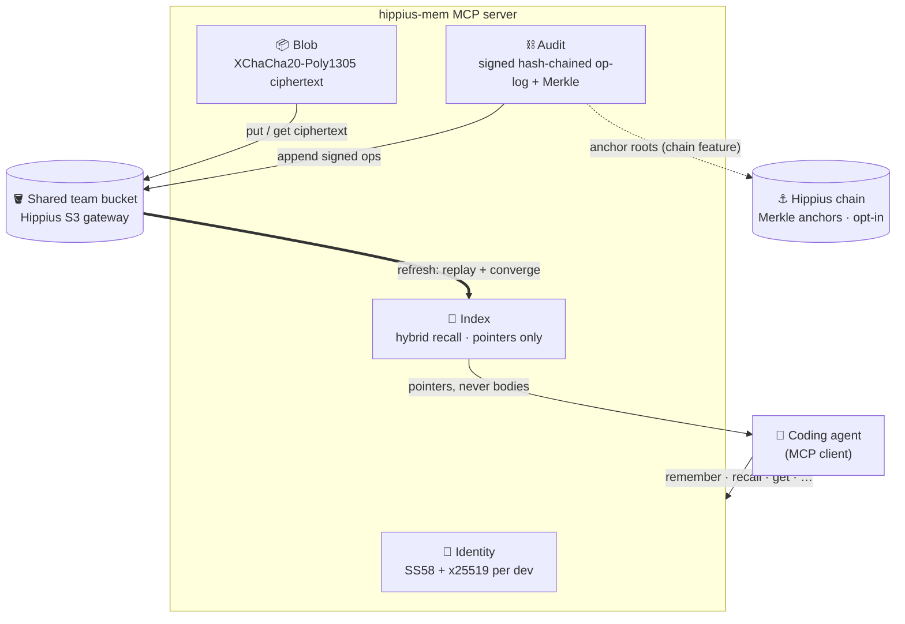

# Reference

Install details, configuration, multi-team routing, MCP tools, operating model,
dashboard, architecture, Cargo features, scope by phase, and operational limits.
Part of [hippius-mem](../README.md) · [Teams](TEAMS.md) · Reference · [Security](SECURITY.md) · [Agent support](AGENTS-SUPPORT.md) · [Invariants](INVARIANTS.md)

## Install details

The [README install](../README.md#install) covers the normal path (`git clone` +
`sh scripts/install.sh`: prebuilt when one exists, source build otherwise). This
section is the fine print.

<details>
<summary><b>What <code>init</code> and <code>install</code> write</b></summary>

Both wire Claude Code so an agent obeys the team-memory rules automatically. Both are
idempotent and preserve anything else already in the files.

| Command | Scope | Writes |
|---------|-------|--------|
| `hippius-mem init` | current repo | a marker-delimited mandates block in `CLAUDE.md` **and** `AGENTS.md` (the latter with an honor-system preamble for agents that do not run our hooks — see [Agent support](AGENTS-SUPPORT.md)); the five hooks (recall gate + token, remember nudge, seed nudge, session brief) in `.claude/hooks/` merged into `.claude/settings.json`; `.hippius-mem/`, `.fastembed_cache/`, and `hippius-mem.toml` in `.gitignore`. It does **not** write a `.mcp.json` server entry — it *removes* any stale one (a project entry only shadows the global registration), leaving the repo free to commit `.mcp.json` for other servers. As a side effect it also ensures the user-global MCP registration so a standalone `init` is not a silent no-op. Flags: `--no-hooks`, `--allow-overwrite-tracked`, `--uninstall`. |
| `hippius-mem install` | user-global | the mandates block in `~/.claude/CLAUDE.md` and the server in `~/.claude.json` (an **absolute** binary path, plus `HIPPIUS_MEM_CONFIG` pinned to the user-global config file, since a user-scope server has no fixed cwd). This is the *only* place the MCP server is registered — registration is global-only. It does **not** install the `hippius-mem` binary; `scripts/install.sh` (or `cargo install`) does that. |

On every server boot, if Claude Code is the active agent (`CLAUDECODE`) and the cwd is a
git repo, the server also refreshes the committed `CLAUDE.md` block so the mandates track
the running binary — best-effort, never installing hooks and never aborting the server.
A committed, clean `CLAUDE.md` is never silently downgraded.

</details>

<details>
<summary><b>Manual install (no curl-pipe)</b></summary>

```bash
# 1. Build (pick the retrieval mode) and put it on PATH. `dashboard` adds the browse UI,
#    matching what scripts/install.sh's source path builds; drop it for a smaller binary
#    without `dashboard`. `--locked` matches the installer.
cargo install --path hippius-mem --features embeddings,dashboard --locked   # semantic recall + UI (~90 MB on first run)
# or `cargo build --release` for a lexical-only build — see
# [Retrieval honesty](SECURITY.md#retrieval-honesty).

# 2. Provision + register (from your project directory).
hippius-mem init      # CLAUDE.md + AGENTS.md + hooks + .gitignore (removes any stale .mcp.json entry)
hippius-mem install   # user-global ~/.claude/CLAUDE.md + ~/.claude.json (registers the MCP server)
# (or register by hand: claude mcp add hippius-mem -- "$(command -v hippius-mem)")

# 3. Point it at a config (see Configuration) and validate the bundle.
export HIPPIUS_MEM_CONFIG="${XDG_CONFIG_HOME:-$HOME/.config}/hippius-mem/hippius-mem.toml"
hippius-mem doctor            # live seal→put→get→open probe
hippius-mem doctor --offline  # field/key validation without the network
```

> [!NOTE]
> The server speaks the MCP stdio protocol on **stdout**; diagnostics go to **stderr**
> via `tracing` (control verbosity with `RUST_LOG`, e.g. `RUST_LOG=info`), so stdout
> stays a clean protocol channel.

</details>

### Uninstall

A full install leaves four things on a machine: the **per-repo** wiring, the
**user-global** wiring, the **binary**, and the (secret-bearing) **config file**. Remove
them in that order.

1. **Per repo — `hippius-mem init --uninstall`.** Run it in each repo you provisioned. It
   removes the marker-delimited mandates block from `CLAUDE.md` **and** `AGENTS.md`, drops
   the five hooks from `.claude/settings.json`, and removes any repo-scope `.mcp.json`
   server entry. (The `.gitignore` lines it added survive on purpose — the config they
   ignore may still exist; delete them by hand once the config is gone.)
2. **User-global wiring — `hippius-mem install --uninstall`.** This reverses `install`:
   it removes the `hippius-mem` entry under `mcpServers` in `~/.claude.json` (leaving the
   rest of that file — Claude Code's own state — untouched) and drops the
   `<!-- hippius-mem:start -->…<!-- hippius-mem:end -->` block from `~/.claude/CLAUDE.md`.
3. **The binary.** `rm ~/.local/bin/hippius-mem` (or `$HIPPIUS_MEM_BIN_DIR`) for a
   prebuilt install; `cargo uninstall hippius-mem` for a source install.
4. **The config file (holds secrets).**
   `rm "${XDG_CONFIG_HOME:-$HOME/.config}/hippius-mem/hippius-mem.toml"` (or wherever
   `HIPPIUS_MEM_CONFIG` points). The disposable caches under `~/.cache/hippius-mem` and
   the local state under `~/.local/share/hippius-mem` can go too — nothing verified is
   lost with them.

## Configuration

The server loads a TOML file, then overlays `HIPPIUS_MEM_*` environment variables,
which win over file values.

**Where the file lives** (this is the usual source of a first-run
`bucket is required but empty` error):

| How you launched | Path used |
|------------------|-----------|
| `HIPPIUS_MEM_CONFIG` is set | that path, always |
| Claude Code via `hippius-mem install` | the user-global file below — `~/.claude.json` pins `HIPPIUS_MEM_CONFIG` |
| `scripts/install.sh` / `quickstart` / `join --bundle` write | `${XDG_CONFIG_HOME:-$HOME/.config}/hippius-mem/hippius-mem.toml` |
| a bare `hippius-mem doctor` / `serve` with no env var | `./hippius-mem.toml` in the cwd if present, **else** the user-global file above |

The installer writes the XDG path. Claude Code finds it because the MCP entry
pins the env var — and a bare CLI command finds it too: with no `HIPPIUS_MEM_CONFIG`
and no `./hippius-mem.toml` in the cwd, `doctor` / `serve` fall back to that same
user-global file, so `hippius-mem doctor` works from any directory right after
`quickstart`. A cwd-local `hippius-mem.toml` still takes precedence when present, so
a project can pin its own config. (This resolution is identical on macOS and Linux.)

| TOML field | Env var | Meaning |
|------------|---------|---------|
| `s3_endpoint` | `HIPPIUS_MEM_S3_ENDPOINT` | S3 gateway URL (default `https://s3.hippius.com`). |
| `s3_region` | `HIPPIUS_MEM_S3_REGION` | Gateway region label (default `decentralized`; a Hippius marker, not an AWS region). |
| `bucket` | `HIPPIUS_MEM_BUCKET` | Team-owned bucket holding the memory blobs. |
| `access_key_id` | `HIPPIUS_MEM_ACCESS_KEY_ID` | S3 sub-token id used to sign requests. |
| `secret` | `HIPPIUS_MEM_SECRET` | S3 sub-token secret. 🔒 Redacted in logs. |
| `team` | `HIPPIUS_MEM_TEAM` | Namespace scoping every note — the **primary profile's** name (the object-key prefix). |
| `orgs` | — | Git-remote patterns the primary profile owns — the **bare** `host/org` or `host/org/repo` (no scheme, no `git@`, no `.git`; a URL is rejected at startup). Empty (default) makes the primary a **catch-all** that matches every repo. File only, no env var. |
| `catch_all` | — | Force the primary to be the catch-all even when it has `orgs`. Effective catch-all = `catch_all` OR empty `orgs`. File only, no env var. |
| `team_key_hex` | `HIPPIUS_MEM_TEAM_KEY_HEX` | 64 hex characters decoding to the 32-byte shared team encryption key. 🔒 Redacted in logs. |
| `author_seed_hex` | `HIPPIUS_MEM_AUTHOR_SEED_HEX` | 64 hex characters decoding to this developer's 32-byte sr25519 signing seed. Every op is signed with it; the SS58 identity is derived from it, so there is no separate address to configure. 🔒 Redacted in logs. |
| `founder_ss58` | `HIPPIUS_MEM_FOUNDER_SS58` | SS58 of the team's pinned founder. When set, the founder-consistency check trusts *this* address rather than whichever manifest has the lowest version, closing the genesis-manifest-takeover gap locally. `None` (default) keeps trust-on-genesis (a startup warning is logged). Not a secret. |
| `anchor_threshold` | `HIPPIUS_MEM_ANCHOR_THRESHOLD` | Ops per anchored Merkle batch (default 16). A malformed override is ignored with a warning, keeping the file/default value. |
| `require_signed_anchors` | `HIPPIUS_MEM_REQUIRE_SIGNED_ANCHORS` | Reject **unsigned** (legacy, pre-signing) anchor records on the audit/proof read paths — the opt-in strict phase of anchor-record signing. Default `false` keeps the migration posture (unsigned records still read, with the false-alarm residual documented in [Security](SECURITY.md#threat-model--honest-limits)). The operational path to strictness: **every member runs `hippius-mem admin resign-anchors`** (re-signs their own legacy records in place; see [Operating model](#operating-model)), watch `reconcile`'s `unsigned_anchor_records` reach `0`, **then** enable. Enabling while the gauge is above 0 does not merely discard proof material — an op whose sole anchor is a legacy unsigned record flips from detected to undetected if suppressed (see [Security](SECURITY.md#threat-model--honest-limits)). Env values are case-insensitive: unset keeps the file value; `0`/`false`/`no`/`off`/empty turn it off; anything else set turns it on. |
| `chain_ws_url` | `HIPPIUS_MEM_CHAIN_WS_URL` | WebSocket URL of a Hippius node. Only honoured when the `chain` feature is compiled in; when set, Merkle roots are anchored on-chain instead of locally. |
| `semantic_embeddings` | `HIPPIUS_MEM_SEMANTIC_EMBEDDINGS` | Rank `recall` with the local dense model instead of the lexical fallback. **Defaults to on in a `--features embeddings` build** and off in a lean build; set `false` to force the lexical fallback. Without the feature a `true` value warns and falls back to lexical. |
| `embedding_model` | `HIPPIUS_MEM_EMBEDDING_MODEL` | Which local model semantic recall uses: `bge-small` (default) or `minilm` (`all-MiniLM-L6-v2`). Only under `--features embeddings`; an unknown name is a startup error. |
| `relevance_floor` | `HIPPIUS_MEM_RELEVANCE_FLOOR` | Override the minimum cosine at which a candidate counts as a match, in `[0.0, 1.0]`. Lower = looser; higher = stricter. Defaults to the model's calibrated floor (MiniLM `0.25`, bge-small `0.55`). |
| `max_epoch` | `HIPPIUS_MEM_MAX_EPOCH` | Highest team-key epoch to try during startup epoch-key bootstrap (default 0). **After rotating the team key you must raise this to the newest epoch** — a too-low value silently caps the bootstrap and leaves notes written under a rotated epoch undecryptable. A malformed override is ignored with a warning. |
| — | `HIPPIUS_MEM_STATE_DIR` | Base directory for this machine's local **state** — today `hippius-mem/state/<team>/head-watermarks.json`, the per-author head high-water marks that back `reconcile`'s `head_regressions`. Env var only, no TOML field. Unset resolves the first of `XDG_STATE_HOME`, `XDG_DATA_HOME`, `$HOME/.local/share` that is set, so on a default macOS/Linux box the file lives under `~/.local/share/hippius-mem/state/`. Deleting a team's file is the documented remedy for the benign regressions in [Security](SECURITY.md#threat-model--honest-limits); it also disables rollback detection until this machine verifies a head again. |
| — | `HIPPIUS_MEM_CACHE_DIR` | Root of the **disposable** encrypted blob cache (per-team subdirectory). Env var only, no TOML field. Unset uses `$XDG_CACHE_HOME`, else `~/.cache`, under `hippius-mem/<team>`; `off` or an empty value disables caching. Safe to delete — it is rebuilt from the bucket, and unlike the state directory nothing verified is lost with it. |
| — | `HIPPIUS_MEM_ALLOW_INSECURE_ENDPOINT` | Opt out of the `https://`-only requirement on `s3_endpoint`, for a local or dev gateway (e.g. MinIO over http). Env var only. Unset/`0`/`false` keeps the requirement. Note bodies are E2E-encrypted regardless, but over http the object **keys and metadata** (note ids, key epochs, member SS58s) travel in cleartext — do not set this against a production gateway. |

<details>
<summary><b>Example <code>hippius-mem.toml</code></b></summary>

```toml
bucket = "ourovoros-memory"
access_key_id = "AKID..."
secret = "<s3-sub-token-secret>"
team = "ourovoros"
team_key_hex = "0123456789abcdef0123456789abcdef0123456789abcdef0123456789abcdef"
author_seed_hex = "fedcba9876543210fedcba9876543210fedcba9876543210fedcba9876543210"
# chain_ws_url = "wss://rpc.hippius.network"   # only with --features chain
# semantic_embeddings = true                    # only with --features embeddings
# embedding_model = "bge-small"                  # default; or "minilm"
# relevance_floor = 0.55                         # override the model's calibrated floor
```

</details>

### Routing memory to multiple teams

One machine often spans both **company** work (shared with teammates) and **personal**
projects (yours alone). hippius-mem keeps them apart by binding **exactly one profile per
repo**, chosen from the repo's git `origin` remote at startup — so each context writes to
its own bucket under its own key, and notes never cross between them.

The two roles a profile plays:

- **Company / team memory** — an org-routed `[[teams]]` profile whose `orgs` match your
  company's git org (e.g. `github.com/acme`). Its bucket and `team_key_hex` are **shared**
  with teammates, so everyone on the team reads and writes the same encrypted memory.
  Repos under that org route here.
- **Personal memory** — the **catch-all**: the top-level (primary) profile, which has no
  `orgs`. Every repo that matches no company profile — side projects, forks, client repos,
  a repo with no remote — lands here, under **your own** bucket and key. Nothing here is
  shared; it is private to you (though you can use the same personal profile across your own
  machines by reusing its `team_key_hex`).

So a typical setup is *personal as the catch-all, company as an org-routed team* — exactly
the example below. Add `[[teams]]` blocks, each a **self-contained profile** with its own
bucket, sub-token, key, and seed. A repo routes to the **first** profile whose `orgs` match
its remote; a repo matching none falls to the personal catch-all; a repo matching none with
**no** catch-all gets **no memory** for that session (the tools say why — nothing leaks into
a team).

```toml
# ~/.config/hippius-mem/hippius-mem.toml

# PERSONAL (private) — the primary/top-level profile. With no `orgs` it is the
# catch-all, so unmatched repos (and repos with no git remote) land here, under your
# own bucket and key. Not shared with anyone.
team = "personal"
bucket = "alice-personal-mem"
access_key_id = "AKID..."
secret = "<secret>"
team_key_hex = "…64 hex…"
author_seed_hex = "…64 hex…"

# COMPANY (shared) — repos under this org route here; the bucket + team_key_hex are
# shared with teammates, so the whole team reads/writes the same memory.
[[teams]]
name = "ourovoros"                 # also the note namespace (object-key prefix)
orgs = ["github.com/thenervelab"]  # repos under this org route here
bucket = "ourovoros-memory"
access_key_id = "AKID..."
secret = "<secret>"
team_key_hex = "…64 hex…"
author_seed_hex = "…64 hex…"

[[teams]]
name = "clientx"
orgs = ["github.com/clientx"]
bucket = "clientx-memory"
access_key_id = "AKID..."
secret = "<secret>"
team_key_hex = "…64 hex…"
author_seed_hex = "…64 hex…"
```

- **`name` is the note namespace** (the object-key prefix). A flat config's namespace is its
  `team` value, so upgrading a flat config to `[[teams]]` leaves existing notes in place.
- **`orgs`** entries are the **bare** `host/org` (a whole org) or `host/org/repo` (one repo),
  matched against the repo's normalized `origin` remote — the scp (`git@host:org/repo.git`),
  https, and `ssh://` URL forms all fold to `host/org/repo`. Write the bare form, **not** a
  URL or clone address:

  | ✅ correct | ❌ wrong |
  |-----------|---------|
  | `github.com/thenervelab` | `https://github.com/thenervelab` (has a scheme) |
  | `github.com/acme/app` | `git@github.com:acme/app.git` (userinfo + `.git`) |
  | `gitlab.example.com/grp/sub` | `github.com` (missing the org) |

  A pattern carrying a scheme, `git@`, a `.git` suffix, a `:port` on the host, an empty
  segment (leading or doubled `/`), a sub-2-character host, or the wrong number of
  `/`-segments matches **no** remote, so its repos would silently fall through to the
  catch-all. The loader mirrors the resolver's own remote normalization and rejects such a
  pattern at startup (`org pattern … is malformed`), naming the bare form to use — it no
  longer misroutes silently.
- **At most one catch-all.** A profile with empty `orgs` (or `catch_all = true`) is the
  catch-all; configuring two is a startup error.
- **Backward compatible.** A flat config with no `orgs` and no `[[teams]]` is a single
  catch-all profile — identical to previous behavior.
- **Add a profile later.** The example above is what a fresh install writes when you answer
  its prompts, but you can append a company `[[teams]]` profile to an existing config at any
  time with `sh scripts/install.sh --add-team` — no need to hand-edit (see
  [Install](../README.md#install)).

> [!NOTE]
> **`HIPPIUS_MEM_*` env overrides apply only to the primary (top-level) profile**, not to
> `[[teams]]` blocks — an env var is single-valued. Configure additional profiles in the
> file.

> [!IMPORTANT]
> **The team key is a shared secret.** `team_key_hex` is a 64-hex-character (32-byte)
> secret shared by every team member. All notes are encrypted under it, so any member
> can decrypt any member's notes — **guard it like a password.** A statically configured
> `team_key_hex` is still supported, but Phase 3 replaces hand-copying it with
> cryptographic distribution: the founder wraps the key to each member's published
> x25519 key and a joining member bootstraps it with `fetch_team_key`; rotation
> re-wraps a new epoch to the current members only. See
> [Phase 3](SECURITY.md#phase-3--identity-teams-and-key-distribution).

**Getting an S3 sub-token.** The `access_key_id` / `secret` pair is a Hippius
object-store sub-token scoped to the team bucket. A sub-token can only be minted by the
account that **owns** the bucket, so the **founder** (bucket owner) mints them: in the
hippius-console flow, authenticate as the bucket-owning account, then
`POST /api/objectstore/sub-tokens/`, which returns `{ access_key_id, secret }` with
`read`/`write` actions on the bucket. Mint one per developer and hand each out — every
developer then holds their own sub-token, but the founder's account owns all of them.

## Operating model

What is driveable from the shipped binary versus what is still only a library call,
stated plainly.

<details open>
<summary><b>✅ Wired into the binary</b></summary>

- **The MCP server** — the ten memory tools, the default mode (no subcommand). On
  startup it syncs the index from the op-log and best-effort bootstraps the epoch
  key-ring. On a **local trial vault**, concurrent sessions follow an
  N-reader-1-writer rule: the first live session takes the vault's write role
  (an exclusive advisory `flock`) and keeps full read-write; every later
  concurrent session boots successfully in **read-only** mode — `recall` / `get`
  / `history` / `reconcile` / `refresh` work, while `remember` / `edit` /
  `forget` / `redact` / `link` refuse in-band with a message naming the
  write-locked profile (write in the first session, or in a new session after it
  exits). Every session, reader or writer, also holds a shared liveness lock so
  `upgrade` can tell the vault is in use. Both locks are OS advisory `flock`s
  released the moment a process exits, so a crashed session can never leave a
  stale lock behind.
- **`quickstart [--team <name>] [--no-wire]` / `upgrade`** — the solo-trial lifecycle.
  `quickstart` writes a local (no-gateway) trial-vault config, probes it with `doctor`,
  and wires Claude Code (unless `--no-wire`); it refuses if a config already exists.
  `upgrade --bucket <name> --access-key-id <id> [--team <name>] [--endpoint <url>]` flips
  that trial vault to a paid Hippius S3 bucket — probes the destination, copies every
  object, then rewrites the config to `storage = "s3"` (the S3 secret is prompted on the
  terminal or read from stdin, never argv). `upgrade` refuses while **any** live
  session — the writer or a read-only one — is still bound to the trial vault
  (close every running Claude Code session using it first), and holds the
  vault's locks for the whole migration so no session can bind mid-copy. See
  [Install](../README.md#install).
- **`init` / `install`** — provision Claude Code so an agent obeys the team-memory
  rules automatically. `init` writes the mandates block, the five hooks, and the
  `.gitignore` lines into the current repo (and removes any stale project `.mcp.json`
  entry — the server is registered global-only); `install` writes the user-global
  `~/.claude/CLAUDE.md` + `~/.claude.json` and is where the MCP server is registered.
  On each boot the server also refreshes the committed `CLAUDE.md` block when Claude
  Code is the active agent (best-effort). See [Install](../README.md#install).
- **`mint-token` / `invite`** — `mint-token` mints a per-developer S3 sub-token from a
  mnemonic; `invite [--name <label>]` mints one **and** prints the paste-ready invite
  bundle a teammate consumes with `join --bundle` (see [Add a
  teammate](TEAMS.md#add-a-teammate-runbook)). Both only compiled with the `console`
  feature.
- **`dashboard [--port <n>] [--no-open]`** — serves the loopback, token-gated read-only
  browse / search / history UI over your vaults and opens your browser at it (`--no-open`
  suppresses that; a headless/SSH environment auto-skips it). Only compiled with the
  `dashboard` feature. See [Dashboard](#dashboard).
- **`publish-membership --members <ss58,...>`** — publishes a founder-signed team
  manifest to close membership.
- **`join [--bundle [<path|->] [--orgs <host/org,...>]]` / `provision` / `members`** — the
  onboarding flow. `join --bundle` consumes a founder's invite bundle, writing the local
  config (a fresh machine's primary profile, or an org-routed `[[teams]]` profile on an
  existing config with `--orgs`); a conflicting profile name, `s3_endpoint`, or too-low
  `max_epoch` is refused with guidance, never silently overwritten. Easiest path: run
  `hippius-mem join --bundle` with no path, PASTE the bundle at the prompt, then press
  Ctrl-D on an empty line to finish; with
  stdin piped instead of a terminal, no-path `--bundle` reads to EOF exactly like
  `--bundle -`. Bare `join` (requires
  `HIPPIUS_MEM_MNEMONIC`) only publishes this member's signed key. The founder runs
  `provision` to wrap the current-epoch team key to every published, manifest-authorized
  member key; `members` prints the founder-signed membership (one SS58 per line, or a note
  that the team is open).
- **`recover`** — the founder-key-loss escape hatch: rotate the founder identity itself
  through the team's published recovery key (the seed is prompted on the terminal or read
  from stdin, never accepted via argv).
- **`report [--since <7d|Nd|Nw>]`** — renders the team ROI digest to stdout: reused notes
  (all-time), then windowed activity (default window 7d). Unlike `brief`, a real error
  (bad config, unbuildable store) is not silenced.
- **`gc [--dry-run] [--grace-hours N]`** — reclaims orphaned note-ciphertext blobs left by
  a cancelled or crashed write (default grace 24h). Administrative — run by an operator or
  cron, not on every session start. Fails closed while any author's op-log chain is
  quarantined (a partial referenced set could reap live notes); a persistent quarantine
  is remediated with `admin quarantine` below.
- **`admin quarantine [--remove <object-key> [--yes]]`** — inspects a persistent op-log
  quarantine: classifies each quarantined author as **fork** (two-plus signed ops naming
  the same predecessor; the losing branch never converged and is removable) versus
  **gap** (a dangling tail whose predecessor object is missing; refused — those are
  honest writes, and deleting them cannot heal the gap), naming every dropped op's exact
  `_oplog/` object key plus the surviving chain's tip. `--remove <object-key> --yes`
  deletes exactly one fork-losing op object, only after two fresh verified reads BOTH
  report it as a dropped fork-loser leaf (a transient listing omission never triggers a
  delete; multi-op losing branches are dismantled leaf-first), then re-reads and reports
  whether the author's chain is whole. Without `--yes` the plan prints as a clearly
  labeled dry-run. Everything shown is signed plaintext op metadata — never note
  content.
- **`admin resign-anchors`** — re-signs THIS author's own legacy (unsigned, pre-signing)
  anchor records in place, so `reconcile`'s `unsigned_anchor_records` readiness gauge
  can actually reach 0 (nothing else ever rewrites an anchor record, and `gc` never
  touches `_anchors/`). Each record is rewritten at its same key as a byte-superset —
  every field untouched, only the signature added — and verified to read back validly
  signed; a record whose present signature does NOT verify is skipped with a warning
  (tamper — re-signing would launder it), and other authors' records are skipped
  (**every member runs this themselves**; only they hold their signer). Run
  `reconcile` first and investigate any `missing_ops` before resigning: signing
  adopts every unsigned record under your key, including one a bucket writer planted
  (the documented pre-strict residual), and a clean Accept-mode reconcile rules that
  out. The migration runbook: every member runs `admin resign-anchors` → watch
  `reconcile`'s `unsigned_anchor_records` reach 0 → enable `require_signed_anchors`.
- **`rotate [--members <ss58,...>]`** — founder-only: rotates the team key to a fresh
  epoch wrapped to the manifest's members and advances the write epoch, printing the
  `max_epoch` every member must adopt. `--members` publishes a shrunk membership first.
- **`remove <ss58>`** — founder-only: the member-removal runbook as one command —
  validates the target against the published roster, re-publishes membership without
  them, rotates the key (the same path as `rotate --members`), and prints the one
  manual step left: revoking the removed member's sub-token in the console. Safe to
  re-run with the same address (a not-yet-rotated key is reported, not a failure). See
  [Remove a member](TEAMS.md#remove-a-member).
- **`brief [--tokens N]`** — prints a token-bounded SessionStart digest of the team's
  live memory (conventions/decisions first, then newest gotchas, then a compact index)
  for the installed session-brief hook to inject. Best-effort: it never blocks or fails
  a session start.
- **`import claude-mem [--project P]... [--type T,...] [--all] [--since YYYY-MM-DD]
  [--query TEXT] [--limit N] [--db PATH] [--dry-run]`** — lifts durable observations
  from a local claude-mem SQLite store into shared team memory. Idempotent across
  re-runs: every imported note carries a provenance tag, and a local ledger remembers
  every tag ever imported so a tombstoned note is never resurrected. Only compiled with
  the `import` feature.
- **`doctor [--offline]`** — validates a configured bundle and proves the encryption
  boundary. It loads the config (checking required fields and that `team_key_hex` /
  `author_seed_hex` each decode to 32 bytes), reports the non-secret coordinates
  (bucket, `access_key_id`, author SS58), then — unless `--offline` — runs a live
  seal→put→get→open probe whose stored object the gateway returns as ciphertext that
  round-trips, proving the note-content encryption boundary holds. Always available (no
  feature gate).
- **Startup epoch-key bootstrap** — best-effort, gated on `HIPPIUS_MEM_MNEMONIC`: on
  boot the server loads every team-key epoch this member can unwrap so a member
  provisioned after a rotation starts able to read newer-epoch notes. A fresh or
  un-provisioned bucket is warned and skipped, never fatal.

</details>

<details>
<summary><b>📚 Library-only (no subcommand yet)</b></summary>

- **Write-epoch selection** — `MemoryStore::set_current_epoch` (which epoch new writes
  seal under) is a library method, not exposed on the binary; `rotate`, `remove`,
  `join`, and the server's startup bootstrap advance it automatically to the newest
  key they hold.

</details>

> [!NOTE]
> **The operable default** is the simplest one: a statically configured `team_key_hex`
> shared out of band, with an **open** team (every signature-verified op converges).
> Publish a manifest with `publish-membership` to close the team to a fixed member set,
> then distribute the key cryptographically with `join` + `provision` and rotate it
> with `rotate` / `remove` when someone leaves.

## MCP tools

| Tool | Purpose | Returns |
|------|---------|---------|
| `remember` | Store a note: `note_type` (`decision`/`convention`/`gotcha`/`reference`/`context`), optional `repo`, optional `tags`, `summary`, `body`, optional `force`. A summary that is a **near-duplicate** of an existing live note is refused, naming that note and the three remedies (edit it, `link` with a `rel`, or retry with `force: true`); on a lexical (non-`embeddings`) build the gate only catches near-identical wording. Appends a signed `Remember` op. | The new note's `mem_...` id. |
| `recall` | Search team memory: `text`, optional `repo`, optional `k`, optional `token_budget`. | Ranked pointers — `id`, `summary`, `score`, `repo`, `author`, `updated`. **Never bodies.** |
| `get` | Hydrate one note by `id`. | The full note, including its `body` and current `version` (pass back as `expected_version` on `edit`). |
| `refresh` | Replay the shared team op-log into this machine's index, pulling in teammates' new notes and applying their tombstones. | The number of live notes indexed. |
| `forget` | Tombstone a note by `id` (logical delete). Appends a signed `Forget` op; the note stops surfacing in `recall`, but its content blob is kept for the audit trail. | `{ forgotten: true }`. |
| `redact` | ⚠️ **Permanently** scrub a note's content by `id` (leaked secret, PII, deletion request). Appends a signed `Redact` op, then deletes every ciphertext version — **irreversible**, stronger than `forget`. The signed op (and its anchored leaf) survive, so the redaction stays provable in `history`. | `{ redacted: true }`. |
| `link` | Assert a directed link from one note to another by `id`, with an optional `rel` (`supersedes`/`contradicts`/`refines`/`duplicates`; omitted = plain link). A `supersedes`/`duplicates` target is **demoted** in `recall` (still returned, tagged) so the newer note wins. Appends a signed `Relate` op (`Link` for a plain link). | `{ linked: true }`. |
| `history` | Full op history of a note — who did what, in convergence order — plus its converged links and whether it was forgotten/redacted. Each anchored op carries a Merkle inclusion proof. | Ordered op entries (with per-op anchor proofs), the note's links, and its `tombstoned`/`redacted` flags. |
| `reconcile` | Integrity check: reconcile the visible op-log against the anchored Merkle roots, reporting any anchored op now missing and any root that disagrees with its leaves. **Local mode detects accidental/partial op-log loss only, not adversarial suppression** — that needs the `chain` feature plus chain readback. | `{ ok, checked_batches, total_anchored_ops, unsigned_anchor_records, missing_ops, root_mismatches, quarantined_authors, suppressed_tails, head_regressions, verification }`. `ok` is true exactly when the five evidence vectors (`missing_ops`, `root_mismatches`, `quarantined_authors`, `suppressed_tails`, `head_regressions`) are all empty; `unsigned_anchor_records` is the strict-mode readiness gauge (see `require_signed_anchors` in [Configuration](#configuration)) and never affects `ok`; `verification` records which pass (bucket-only vs chain) produced the report. |
| `edit` | Update a note in place by `id` (any of `summary`/`body`/`tags`; omitted fields keep their value), preserving its identity, `created`, and links. Optionally pass `expected_version` for a compare-and-swap that refuses the edit — note unchanged — if it changed since you read it. Appends a signed `Edit` op. | `{ edited: true }`. |

> [!TIP]
> **The `recall`/`get` split is the context-efficiency mechanism:** an agent searches
> with `recall`, reads the summaries, and calls `get` only for the notes it actually
> needs. `remember`/`edit`/`forget`/`link` mutate through the signed op-log; `refresh`
> pulls teammates' mutations into the local index; `history` exposes the verifiable
> chain of custody; `reconcile` cross-checks that the op-log still matches what was
> anchored.

## Dashboard

A read-only local web UI over your team memory — browse, search, and inspect notes
without the MCP tool surface. **The [installer](../README.md#install) already includes it**, so it is
one command:

```bash
hippius-mem dashboard            # → your browser opens at the dashboard
# add --port <n> to pin the port (default is an ephemeral one)
# add --no-open to just print the URL instead of launching a browser
```

It starts a loopback server and **opens your default browser** at the token URL. The URL
is always printed to **stderr** too, so if the browser does not open — or you passed
`--no-open`, or you are on a headless/SSH box (where auto-open is skipped) — you can open
`http://127.0.0.1:<port>/?t=<token>` by hand. Over SSH, tunnel first:
`ssh -L <port>:127.0.0.1:<port> <host>`.

The dashboard is compiled behind the `dashboard` Cargo feature (it pulls in `axum`; the
default stdio server never links it). A hand build therefore needs the feature explicitly:

```bash
cargo install --path hippius-mem --features embeddings,dashboard
```

- **Drill down: namespaces → repos → notes.** The landing page lists every profile in
  your config (your personal/catch-all profile plus each `[[teams]]`), with the vault
  this repo's git remote routes to badged **"this repo"**. Pick one to see its **repos**
  (each with a note count; `global` is the team-wide bucket), then a repo to reach its
  notes. A vault's store is built and synced **lazily on first open**, so launch is
  instant. To show every namespace regardless of where you launch it, the dashboard reads
  your **global** config (`${XDG_CONFIG_HOME:-$HOME/.config}/hippius-mem/hippius-mem.toml`)
  — *not* a repo-local `./hippius-mem.toml` (that file scopes the MCP server to one team
  per repo). Set `HIPPIUS_MEM_CONFIG` to point it at a specific config instead.
- **Compact, expandable list.** Within a repo, notes render as a dense list; a row
  expands in place to its body, tags, and version, and **Full detail** reveals the
  verifiable history and links — no separate page. Search composes with the type / tag
  filters (the repo is the drill-down, so it is not a filter here).
- **Read-only.** No `remember` / `edit` / `forget` / `redact` / `link` from the UI — it
  only reads (`recall` / `get` / `history`). Curation stays with your agent through the
  MCP tools.

> [!IMPORTANT]
> The dashboard serves your notes **decrypted**, so it binds **loopback only**
> (`127.0.0.1`) and gates every request on a **per-launch random token** (carried in the
> printed URL). That plaintext never leaves your machine, and the page is fully
> self-contained — fonts and assets are embedded; nothing loads from the network.

## Architecture

The server is organized into **four planes**:



| Plane | Responsibility | Status |
|-------|----------------|--------|
| **Index** | Hybrid retrieval over note summaries: a lexical keyword leg, a semantic leg (cosine over `Embedder` vectors) when the embedder carries signal beyond it, and recency scoring; maps a note id to its object key, content hash, scope, tags, and recency. Returns pointers, never bodies. The `Embedder` is pluggable: the default `HashEmbedder` (a deterministic keyword-overlap proxy that reports `contributes_semantic_leg() == false`, so a lean build ranks **keyword-only**) or, under `--features embeddings`, the dense `FastEmbedder` (local `bge-small-en-v1.5`), which does run the semantic leg. | ✅ In-memory (`InMemoryIndex` behind the `MemoryIndex` trait). Rebuildable from the bucket. |
| **Blob** | Stores each note as XChaCha20-Poly1305 ciphertext at key `{team}/{repo}/{mem_id}/ver_{ulid}` on the Hippius S3 gateway (the version segment is a `ver_`-prefixed ULID, newest-wins). | ✅ `S3BlobStore`; `MemoryBlobStore` fake for tests. |
| **Audit** | Tamper-evident trail: per-developer signed op-log batched into a periodic Merkle anchor. Op-log + convergence + Merkle anchoring are always on; on-chain submission is the opt-in `chain` feature. | ✅ Phase 2. See [SECURITY.md](SECURITY.md#phase-2--shared-op-log-convergence-and-verifiable-history). |
| **Identity** | Per-developer SS58 author identity (stamped on every note) and the per-developer S3 sub-token used to write. Mnemonic-derived SS58 + x25519, author bound to key, founder-signed team manifest, team-key wrapping/rotation. | ✅ Phase 3. See [SECURITY.md](SECURITY.md#phase-3--identity-teams-and-key-distribution). |

A note is a single self-contained fact. Each carries a one-line `summary` (surfaced
by `recall`) and a full `body` (returned only by `get`). Notes are scoped by `team`
(the shared namespace) and `repo` (`global` for team-wide), which is the cheap first
filter applied before semantic ranking.

> [!TIP]
> **The index is a derived, disposable cache** — it can be rebuilt at any time from
> the shared team op-log. `MemoryStore::sync` (the `refresh` tool) replays the signed,
> hash-chained op-log, converges it, and rebuilds the local index from the converged
> state — applying teammates' tombstones, not just their additions. This is how a
> machine with an empty index discovers what teammates have written.

### Cargo features

| Feature | Compiles | Needs at runtime |
|---------|----------|------------------|
| `chain` | `SubxtAnchor` — submits Merkle roots on-chain via signed `System::remark_with_event`. | A funded sr25519 account and a reachable Hippius node. |
| `console` | `ConsoleClient` + `eth_signer_from_mnemonic` + the `mint-token` CLI (api.hippius.com sub-token minting). | A network and a real mnemonic. |
| `dashboard` | The `hippius-mem dashboard` command — a loopback, token-gated `axum` web UI for read-only browse / search / history over your vaults, which opens your browser on launch (see [Dashboard](#dashboard)). Bundled by the installer. | Nothing beyond a browser; binds `127.0.0.1` only. |
| `embeddings` | `FastEmbedder` — the dense `Embedder` (`bge-small-en-v1.5` via local ONNX Runtime, or `minilm` via `embedding_model`), selected when `semantic_embeddings` is set. | A one-time model download (~90 MB) into fastembed's cache; embedding then runs locally. |
| `s3-integration` | The `S3BlobStore` live round-trip test (stays `#[ignore]`d). | A real gateway endpoint and sub-token credentials. |
| `import` | The `hippius-mem import claude-mem` command — lifts durable observations from a local claude-mem `SQLite` store into team memory (see [Operating model](#operating-model)). | Links `rusqlite` (bundled `SQLite`); reads the claude-mem db read-only. |

**Default vs release size.** None of the features above are on by default, so a
plain `cargo build -p hippius-mem` stays on the lexical `HashEmbedder` and never
links ONNX Runtime, axum, alloy, subxt, or SQLite. The installer and
cargo-dist release artifacts enable `embeddings,dashboard` on purpose (semantic
recall + local UI; see [Retrieval honesty](SECURITY.md#retrieval-honesty)). Day-to-day
development should prefer the default (or `dashboard` alone) and avoid
`--all-features` unless you are exercising every optional surface — each combo
adds compile cost and grows `target/`. `Cargo.lock` still lists optional crates
even when you do not build them; that is lockfile resolution, not the linked
binary.

## Scope by phase

An honest statement of what is built now versus planned.

- ✅ **Phase 1.** Single-machine memory engine — `remember`/`recall`/`get` with
  client-side XChaCha20-Poly1305 encryption, an in-memory hybrid index, and the S3 blob
  store — plus shared blob storage and cross-machine discovery.
- ✅ **Phase 2 — done.** Developer-signed append-only op-log in the shared bucket,
  convergence with tombstones (replacing blob-listing rebuild), Merkle batch anchoring
  with opt-in on-chain submission (`chain` feature), and the `refresh` / `forget` /
  `link` / `history` tools.
- ✅ **Phase 3 — done.** Mnemonic-derived identity (SS58 + x25519, author bound to key),
  founder-signed team manifest with membership filtering, team-key wrapping /
  provisioning / forward-readable rotation, and `console`-gated sub-token minting
  (`mint-token` CLI).
- 🚧 **Phase 4 (current) — done, except disk-based ANN.** Built: **epoch-tagged note
  encryption** with an in-store key-ring (each note seals under its write epoch's key;
  readers decrypt with whichever epoch key they hold, so notes from an old epoch stay
  readable after rotation); **authoritative sync** (`MemoryStore::sync` prunes the *live*
  index down to the converged set via `MemoryIndex::retain`, so a removed member's or
  tombstoned note is dropped on the next sync — not only on a cold rebuild);
  **cold-start index snapshot/restore** plus **incremental op-log tailing** (restore the
  latest snapshot and converge only newer ops, with a full-rebuild fallback when a
  late/out-of-order op or membership change is detected); the **`reconcile` integrity
  tool** (local op-log-vs-anchors check; trust-minimized suppression detection via
  `reconcile_with_chain` under `chain`); the **`edit` tool**; a **convergence/partition
  stress suite**; and **criterion benches** for the measured perf pass.
  ⏳ Still deferred: **disk-based ANN (LanceDB)** for scale.

## Operational limits

Stated plainly, with a plan, not an apology.

**The index is in-memory and rebuilt from the op-log.** `InMemoryIndex` holds nothing
durable of its own; every `recall` result exists because `sync` replayed and converged
the signed op-log — restoring the latest snapshot and tailing only the newer ops when
one exists, or a full cold rebuild when it does not (see
[Architecture](#architecture)). There is no persistent index today.

**`history` and `sync` re-verify op signatures on every call.** `OpLogStore::read_all`
re-derives trust from the ops themselves rather than trusting a previous read: it
verifies each op's signature and walks each author's hash chain every time (see
[Threat model — honest limits](SECURITY.md#threat-model--honest-limits)). That
re-verification is what makes the untrusted-bucket model hold, and it is also the cost
that scales with op-log length.

**Measured ceiling.** A ~590-op log took ~20 s to fetch cold, because the Hippius
gateway saturates on the fan-out of many small op objects before the client does. This
is recorded in-repo, not only in team memory: `hippius-mem-core/src/oplog/store.rs`
(the doc comment on `OPLOG_FETCH_CONCURRENCY`) reports the same log took ~35 s at 16
in-flight GETs and ~20 s at 64 — the gateway saturating, not the client — from the
measurement pass in PR #37. Op-log length, not note count or bucket size, drives
cold-sync latency: the log records every mutation (including edits and tombstones), so
a long-lived team accumulates more ops than notes.

**What this means operationally.** Cold-sync latency degrades with a team's op-log
length well before the index, encryption, or anything else in the pipeline becomes the
bottleneck — a team with a long history sees slow cold syncs first. This lands hardest
on a brand-new machine joining an established team's bucket, or any restart with no
local snapshot. The Phase 4 checkpoint/snapshot path (see
[Scope by phase](#scope-by-phase)) makes every *subsequent* sync on that machine
incremental, so the cost is paid once per machine, not once per sync.

**Plan of record.** Port the op-log to S4/hippius-log when it lands: a log-native store
removes the many-small-objects-over-S3 fan-out this measurement blames, rather than
tuning around it. LanceDB ANN for the index (already the deferred item above) is the
next answer after that, for `recall`'s cost rather than cold sync's. Both are named as
the plan, not scheduled work in this program — S4/hippius-log does not exist yet to
port to.

## Design and plan

- 📄 [Design](plans/2026-06-26-hippius-memory-design.md)
- 📄 [Implementation plan](plans/2026-06-26-hippius-memory-implementation-plan.md)

