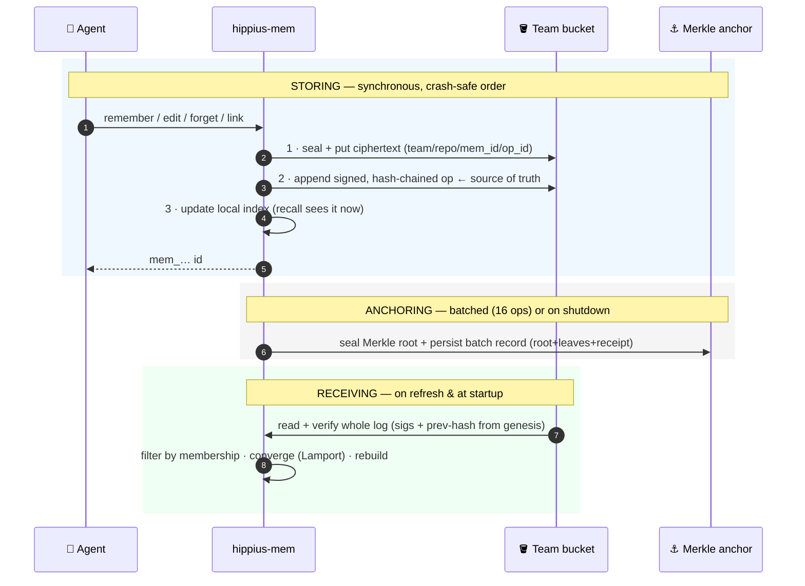

# Security

The encryption boundary, threat model, and how history is stored and verified.

Part of [hippius-mem](../README.md) · [Teams](TEAMS.md) · [Reference](REFERENCE.md) · Security

## Encryption boundary

What leaves your machine encrypted, and what deliberately does not:

- **Sealed: note content.** A note's content is encrypted in-process with
  XChaCha20-Poly1305 under the current team-key epoch **before** the ciphertext is
  written to the bucket, so the gateway — and anyone who can read the bucket — only
  ever sees ciphertext. `hippius-mem doctor` proves this boundary end-to-end with a
  live seal→put→get→open probe whose stored object round-trips as ciphertext.
- **Cleartext by design: the op-log envelope.** The signed op recording each change
  carries its metadata in the clear — team/repo names, the author's SS58 address,
  timestamps, and the op hashes. That is deliberate: it is what lets any reader —
  including one holding no decryption key — verify signatures, hash chains,
  membership, and Merkle inclusion proofs, so the audit trail stays independently
  checkable without disclosing note content. The practical consequence: whoever can
  read the bucket can see *who wrote, when, and under which team/repo namespace* —
  but never *what*.

## Threat model — honest limits

The shared bucket is treated as **untrusted**: a peer or the storage provider may add,
edit, or drop objects. Trust is re-derived from signatures and hash chains on every
read. What that does and does not buy you, stated plainly.

> [!WARNING]
> These are real, deliberate limits — not oversights. Read them before you rely on the
> audit trail for anything adversarial.

**What the audit trail does *not* guarantee:**

- **Removing a member does not revoke their access by itself.** Membership filtering
  stops a removed member's *new ops from converging*, but they keep their S3 sub-token
  and the current team key until **both** are dealt with: the team key must be rotated
  (`hippius-mem remove` does this, or `rotate --members`) and the sub-token must be
  revoked at the gateway — the one step that stays manual. Until then, a removed member
  can still read and write the bucket directly and decrypt notes sealed under the
  un-rotated key.
- **`reconcile`'s anchoring checks detect accidental loss, not adversarial suppression.**
  They cross-check the visible op-log against anchored Merkle roots and flag an anchored
  op that has gone missing or a record whose root disagrees with its leaves — i.e.
  accidental or partial op-log loss. They do **not** catch a bucket that drops an op
  together with its anchor record (nothing is left to reconcile against). The `chain`
  feature does **not** close that particular gap either: `reconcile_with_chain` reads
  the committed root back from the chain the bucket cannot forge, which catches a record
  the bucket *kept* but never actually committed — but it too iterates only the records
  the bucket still serves, so an omitted record is never examined. Two other checks can
  still catch it, neither of which needs an anchor record. When the dropped op is
  **mid-chain**, the next op's `prev_op_hash` dangles and the break surfaces as
  `quarantined_authors`. When it is the author's **tail**, `suppressed_tails` below
  reports it — *unless* that author's head does not name the tail, whether because the
  bucket dropped or rolled it back or because a best-effort publish had already failed;
  those are that check's own stated residuals. Those two cases are exhaustive for one
  author's chain: for no `prev_op_hash` to dangle, the dropped set must be a suffix of
  the chain, and a suffix is a tail truncation. So what survives every check is a tail
  whose anchor record is gone AND whose head does not name it — because the bucket dropped
  the head, served a stale one, or because a best-effort publish had already failed and left
  the previous tip named. It is never some separate mid-history class. Of those three, the
  first two are reported by `head_regressions` on a machine that had already verified the
  higher head, so what survives there is only the failed-publish case; on a machine with no
  mark for the author, all three survive.
- **`reconcile`'s `suppressed_tails` narrows tail truncation; it does not close it.**
  Nothing in the hash chain points at an author's newest op, so a truncated view used to
  be indistinguishable from one where the tail was never written. Every write now
  publishes a signed `HeadPointer` at `{team}/_heads/{author_key}` naming that author's
  current tip, and `reconcile` reports an author whose head names a tip the visible log
  does not contain. Because the claim is signed, the bucket cannot forge or edit it —
  suppression now requires *dropping or rolling back a signed object* rather than
  silently omitting one. Three residuals remain, all silent. Two need an active bucket: one
  that drops the head object along with the tail op leaves no claim to contradict, and one
  that serves an **older, still-validly-signed** head names a tip that IS visible. The third
  needs no attacker at all — publishing the head is deliberately best-effort, since the op is
  already durable and failing a write over a redundant pointer would be worse, so a publish
  that fails leaves the *previous* tip named. The code treats a lagging head as healthy by
  design (only a head **ahead** of the visible log is evidence), so a tail lost after a failed
  publish is silent for exactly that reason. The first two are covered by
  `head_regressions` below, and only on a machine that had already verified the higher
  head; a machine syncing for the first time stays blind. **An empty `suppressed_tails`
  is therefore not proof that no tail was truncated.** A non-empty one is not proof of an
  attack either: the op may merely have failed to fetch or not been listed on that read
  (self-clearing),
  or it may have been quarantined by a chain break, in which case the same author appears
  in `quarantined_authors`. That pair proves exactly two things — this author's chain broke
  on this read, and the tip they signed is not in the surviving set — and **not** why the tip
  is missing: it may have been quarantined, dropped outright, or merely unfetched. Do not
  conclude "quarantined, so still in the bucket"; hiding a mid-chain op *and* the tail of a
  four-op chain fires the pair with a `claimed_tip` the read never saw. It is also **not** a
  fork signature. A bucket dropping one mid-chain op quarantines the whole post-gap run
  including the tail, so while that author's head survives and is current the pair appears —
  but if the bucket also drops or rolls back the head, or a best-effort publish had already
  failed, the same drop presents as quarantine alone, so quarantine without a tail entry does
  not rule it out either. An equivocating fork produces the pair when the planted branch wins
  the tiebreak, and when a fork is combined with tail truncation. Either way the pair is a
  reason to look harder, not to stand down.
- **`reconcile`'s `head_regressions` protects a returning machine, never a fresh one.**
  Every other check in the report takes both its inputs from the bucket, which is why a
  bucket that DROPS an author's head object, or serves an OLDER but still-validly-signed
  one, is silent in all of them: there is no claim left to contradict, or the claim it
  serves is consistent with the truncated view. This check adds the one input the bucket
  does not control. Each machine remembers, in a local file
  (`$XDG_STATE_HOME/hippius-mem/state/<team>/head-watermarks.json`, overridable with
  `HIPPIUS_MEM_STATE_DIR`; deliberately **not** under the disposable blob cache), the
  highest signed head it has already verified per author. An entry means the bucket now
  serves a head below that mark, or no verifiable head for that author at all. Only the
  key-holder can **sign** a head, so the bucket cannot have fabricated the higher one.
  Five limits, all real. **It does not follow that the bucket withdrew anything** — the
  key-holder can also publish a *lower* head, and two ordinary cases do. *Two processes
  under one identity*: `MemoryStore::writer` is a per-instance mutex that serializes head
  writes within one process only, `publish_head` is an unconditional PUT with no
  compare-and-swap, and MCP registration is user-global, so concurrent agent sessions run
  under the same identity — a head PUT landing after another process's higher one moves
  the served head backward with every op still present, and it clears on the next write
  above the higher Lamport. *A restarted process re-seeding from a short view* mints a
  lower Lamport and publishes a **brand new** head below the mark, so there is no
  rolled-back object to find; if the view was short because of a truncation, the entry is
  a true detection naming the wrong artifact. A hostile bucket dropping or rolling back
  the head produces the same evidence, and that is the step it must take to hide a
  truncated tail. Do **not** "fix" this by exempting your own author key: that discards
  the case where the bucket rolls back *your* head, which is the point.
  **A machine that never saw the higher head cannot detect the rollback** — a first sync,
  a new teammate, a reimaged laptop, a fresh container, a cleared state directory, or any
  deployment where no state directory resolves. That limit is irreducible: the knowledge
  is not on the machine, and no amount of local state puts it there. **It proves a
  lowered head, not a suppressed op** — whether the ops the remembered head named are
  still readable is what `suppressed_tails` answers, and the two vectors are
  independent. **Two further benign causes present identically**: a team
  re-created from scratch under the same name and the same author identity restarts at a
  lower Lamport, so marks from the previous incarnation outrank every head the new one
  publishes; and the mark file is keyed on the **team name alone**, so the same name
  pointed at a restored backup, a staging mirror, or a different endpoint has the same
  effect. The remedy for all of them is to delete that team's state file. **And it does
  not cover the third `suppressed_tails` residual at all** — a head publish that merely
  failed leaves the previous tip named without the served head ever moving backward, so
  there is nothing
  to regress against. This machine's own mark advances only after a head publish actually
  succeeds, precisely so that honest case is never misreported as a rollback. Anyone who
  can write local disk can delete or rewrite this file and thereby disable the check or
  manufacture a false entry; that is out of scope, because such an attacker already
  controls the process doing the verifying.
- **`reconcile`'s `quarantined_authors` proves a broken chain, never its cause.** Each
  entry names an author whose ops the verified read could not link into one
  genesis-rooted chain, and how many ops it therefore dropped; `ok` is false whenever
  the vector is non-empty. Together with `suppressed_tails` it is one of the two checks
  in the report that need no anchor record, so it can implicate an op that was never
  anchored. But at author granularity a hostile fork, a mid-chain object the bucket
  dropped for good, an object this read merely failed to fetch or did not see listed,
  and an honest writer's own cancelled-but-durable append are **indistinguishable**.
  A mid-chain drop ALSO populates `suppressed_tails` for the same author whenever that
  author's head survives and is current, because the post-gap run it quarantines includes
  that author's tip — but a dropped, rolled-back or merely lagging head leaves the same
  drop showing as quarantine alone. See that field for why the pair narrows the cause
  without naming it. The two fetch/listing
  causes clear themselves on a later read, and a cancelled-but-durable append now
  usually clears itself too — the writer best-effort deletes the orphaned op object
  right after the failed append returns (`OpLogStore::reclaim_failed_append`). That
  delete is not instantaneous with the append landing, so a concurrent read can
  still observe the orphan first; the reclaim is also itself best-effort, so if it
  fails the orphan stays in the append-only bucket exactly as before, holding `ok`
  false on every subsequent call — there is still no in-product remediation for
  that case. A hostile fork or a real deletion never clears on its own. It also
  cannot see an author suppressed *whole* (no ops, no chain to break); a chain truncated
  cleanly at its tail is invisible to *this* vector too, and is covered instead by
  `suppressed_tails` above, within the residuals stated there — and, for the two of those
  residuals that need an active bucket, by `head_regressions`, within the limits stated
  there.
- **A snapshot's `summary`, `tags`, `updated` and `note_type` are not verified.** A
  snapshot (checkpoint) is an optimization that lets `sync` restore the index without
  re-decoding every note blob. Each record's body is cross-checked against the signed
  op-log before it is indexed — `note_id`, `object_key`, `cid`, `lamport`, `key_epoch`,
  `author` and `scope` must match what the op-log attests, and a record that disagrees
  is decoded from its blob instead. But a signed op says nothing about a note's *text*:
  those four fields live only in the note blob, so **a holder of the current team-key
  epoch — that is, a current team member — can rewrite another member's summary, tags,
  timestamp or note type as `recall` presents them.** `get` still returns the true note:
  it re-fetches the blob and gates it on the op-attested content hash. Their *size* is
  capped by the same ingestion clamp the full-replay path applies, so a forgery cannot
  be unbounded, only wrong. This is **not** a hostile-bucket exposure — the bucket holds
  no epoch key and cannot seal a snapshot record at all; a snapshot it tampers with
  fails authentication and is skipped. Closing it would require the note's index fields
  to be committed inside the signed op.
- **The incremental snapshot path gates on epoch-key *presence* before correctness.**
  `sync` takes the fast snapshot-restore path only when it holds the current epoch's key
  to open the checkpoint; a member lacking that key falls back to a full replay. That
  gate checks only that a key exists. The per-record cross-check above is what checks
  correctness, within the limits just described.
- **The per-author hash chain catches in-chain tampering, not suppression.** It detects
  in-place edits, mid-chain deletion, and intra-author reordering; it does **not** detect
  tail-truncation, whole-author suppression, or split-view / equivocation. When it does
  fire, the affected author's unlinkable ops are dropped so the rest of the team still
  converges — reported by `reconcile`'s `quarantined_authors` and by a `doctor` line,
  with the caveats above. Tail-truncation is covered *outside* the chain, by the signed
  head pointer described above and by the local head watermarks that back it, each within
  the residuals stated there; whole-author suppression and split-view are not covered at
  all.
- **Anchoring is after-the-fact, so never-anchored ops have no commitment.** `reconcile`
  can only check ops that were batched and anchored; an op dropped before its batch
  anchored leaves no anchored leaf, so its absence is indistinguishable from "never
  written". A lower anchor threshold shrinks this window but never closes it.
- **Local-mode inclusion proofs prove internal consistency only.** With the default
  `NoopAnchor`, a `history` Merkle proof verifies against a root from the same bucket
  this server controls — it shows the op is consistent with a root the server asserts,
  not that the root was independently committed. Trust-minimization requires `chain`
  anchoring **and** a verifier that fetches the root from the chain.
- **The genesis manifest object is not pinned by default.** Founder consistency is
  enforced by treating the lowest-version manifest's founder as authoritative, so an
  attacker who overwrites the *genesis manifest object itself* can reset the trusted
  founder — **unless** you set `founder_ss58` in the config, which pins the trusted
  founder locally (a value the bucket cannot rewrite) and closes this gap today.
  On-chain anchoring is the trust-minimized variant of the same defense (future work).
- **The on-chain `remark` fee/weight is unverified.** The on-chain `remark` fee/length
  limits and public-node submission policy were not verified against the live Hippius
  runtime; the implementation targets the generic FRAME `System::remark_with_event`
  contract.

## How history is stored and received

Every change to memory is an *event*, not an overwrite. The whole model comes down to
**when each event is written, when it is anchored, and when another machine reads it
back.**

**Storing — on every mutation, synchronously.** `remember`, `edit`, `forget`, and
`link` each append exactly one signed event to the team's op-log as part of the call,
in a deliberately crash-safe order:

1. **Seal and store the body.** The note's content is encrypted in-process
   (XChaCha20-Poly1305 under the current team-key epoch) and the ciphertext is written
   to the bucket at `team/repo/mem_id/op_id`, keyed by the new op's ULID so two
   concurrent writes can never collide on one key.
2. **Append the signed op.** One `Op` — `Remember` / `Edit` / `Forget` / `Link` — is
   signed with the developer's sr25519 key, hash-chained to that author's previous op,
   and stamped with a Lamport clock value, then appended to their append-only log in
   the shared bucket. **This durable, signed log is the source of truth.** The order is
   intentional: the blob lands before the op that names it, and the op lands before the
   local index entry, so a crash at any step leaves a recoverable prefix, never a
   dangling reference.
3. **Update the local index.** The in-memory index is updated last, so `recall`
   reflects the change immediately on this machine.

**Anchoring — in batches, not per op.** Each op's hash is a Merkle leaf, buffered as
the op is written. Once a batch reaches the anchor threshold (16 ops in production) —
or on graceful shutdown — it is sealed into a Merkle root and committed, with the
batch record (root + leaves + receipt) persisted to the bucket so any teammate can
build inclusion proofs. Anchoring is local by default, or on-chain with the `chain`
feature, and it is best-effort: the op is already durable in the log, so a failed
anchor is retried on the next batch, never surfaced as a write error.

**Receiving — on `refresh` and at startup.** A machine pulls in teammates' history by
replaying the shared op-log — `refresh` on demand, and automatically on boot:

1. **Read and verify the whole log.** Every op's signature and `prev`-hash link is
   checked from the chain's genesis, so a forged, altered, or reordered op fails
   verification and is rejected before it can affect state.
2. **Filter by membership.** Once a founder has published a signed manifest, only
   current members' ops are admitted; a non-member's well-formed op is dropped.
3. **Converge.** The Lamport clock yields a deterministic per-note state regardless of
   the order teammates' ops arrived in, and a `Forget` tombstone *removes* the note
   rather than leaving it merely absent.
4. **Rebuild authoritatively.** The index is pruned to exactly the live converged set,
   so a removed member's note or a tombstoned note disappears on the next sync. A cold
   machine replays the full log; a warm one restores the latest index snapshot and
   converges only newer ops, falling back to a full rebuild if a late or out-of-order
   op (or a membership change) is detected.

**Reading one note's history.** The `history` tool reconstructs a single note's event
sequence straight from the op-log (not the index), in convergence order, and attaches
each anchored op's Merkle inclusion proof. Anyone — even a machine that never wrote
the op — can call `verify_proof(root, op_hash, proof)` to confirm the op was committed
under that root **without trusting the server**; with `chain` anchoring the root is
on-chain, so the whole "which op, under which root, in which block" trail is publicly
checkable. The cryptographic detail is in
[Phase 2](#phase-2--shared-op-log-convergence-and-verifiable-history).

## Phase 2 — shared op-log, convergence, and verifiable history

Phase 1 stored each note as an encrypted blob and rebuilt the index by listing the
bucket. Phase 2 makes the team's *mutations* the source of truth and gives every op an
independently verifiable chain of custody (the full phase scheme is mapped in
[Scope by phase](REFERENCE.md#scope-by-phase)).

<b>Op-log · convergence · Merkle anchoring · chain of custody</b>

**Op-log (signed, hash-chained).** Every mutation — `Remember`, `Forget`, `Link` —
appends a signed `Op` to a per-developer, append-only log living in the shared bucket.
Each op is signed with the developer's sr25519 key (`author_seed_hex`) and chained to
that author's previous op by hash, so the log is tamper-evident: a reader verifies each
signature and each `prev` link while replaying, and a forged or reordered op fails
verification.

**Convergence (Lamport clock, tombstones).** Each op carries a Lamport clock value;
replaying the log and converging it yields a deterministic per-note state regardless of
the order teammates' ops arrive in. A `Forget` is a tombstone, and the latest lifecycle
op wins — so a forgotten note is actively *removed* from a syncing machine's index,
never merely absent. Two developers writing concurrently both converge: after each calls
`refresh`, both machines hold both notes. Links are grow-only in this phase (there is no
unlink op yet).

**Merkle batch anchoring (on-chain).** Each op's hash is a Merkle leaf. Once a
configurable number of ops accumulate, the batch is sealed into a Merkle root and
anchored, and the batch record (root + leaves + receipt) is persisted to the shared
bucket so any teammate can build inclusion proofs. Anchoring the root on-chain is the
opt-in `chain` Cargo feature: build with `--features chain` and set `chain_ws_url`, and
the root is submitted to a Hippius node as a signed FRAME `System::remark_with_event`
extrinsic. Live anchoring needs a **funded sr25519 account** (the `author_seed_hex`
identity) and a **reachable Hippius node**. With the feature off (the default), roots
anchor locally — the op-log and proofs still work end-to-end, only the on-chain
submission is skipped.

**Chain of custody (`history`).** `history` reconstructs a note's full op sequence
directly from the shared log (not the local index), in convergence order, attaching each
anchored op's Merkle inclusion proof. Anyone — including a machine that never wrote the
op — can call `verify_proof(root, op_hash, proof)` to confirm the op was committed under
that root **without trusting the server**; when chain anchoring is on, the root is
on-chain, so the whole "which op, under which root, in which block" trail is publicly
checkable. The cross-machine proof path is exercised end-to-end in
`hippius-mem-core/tests/e2e_phase2.rs`.

## Phase 3 — identity, teams, and key distribution

Phase 2 made *what teammates wrote* the source of truth. Phase 3 makes *who is on the
team* and *how they get the key to read* cryptographic rather than operational — one
mnemonic per developer, a founder-signed membership list, and team keys wrapped to each
member's encryption key.

<b>Identity · membership · key wrapping/rotation · sub-token minting</b>

**Identity (one mnemonic → SS58 + x25519).** A developer's BIP-39 mnemonic derives an
sr25519 signing key whose public half is their **SS58 address** (`ss58_encode` /
`ss58_decode`, Substrate prefix 42 — the same codec the chain uses, so the address is
the on-chain identity). The same seed *separately* derives an x25519 encryption key
(domain-separated KDF, so the encryption key is independent of any signing use of the
seed). Attribution is **bound to the key**: `MemoryStore` derives the author SS58 from
the signer it holds, and the op-log read path rejects any op whose `author` SS58 does
not decode to its signing key — a writer cannot sign with one key and claim another
identity's address.

**Founder-signed team manifest + membership.** A team is **open** until a founder
publishes a manifest: with no manifest every signature-verified op converges (so a team
dogfoods before it is formalized). Once a founder publishes a signed `TeamManifest`,
`sync` converges only current members' ops — a non-member's well-formed, signed op is
filtered out before it enters converged state. Only the founder may change membership
(`publish_membership`), and the founder is always included, so they cannot lock
themselves out. Removing a member hides **all** of that member's ops on any index
rebuilt from the post-removal log.

**Team-key wrapping, provisioning, and rotation (forward-readable epochs).** The
symmetric team key is no longer a hand-copied hex string. Each member publishes a signed
`MemberKey` (their x25519 public key, bound to their SS58 by an sr25519 signature). The
founder `provision_team_key`s by sealing the team key to every member's x25519 key
(sealed-box: a fresh ephemeral keypair per wrap, ECDH, AEAD — forward-secret per wrap).
A joining member who was never handed the key **bootstraps** it: `fetch_team_key`
unwraps the wrap addressed to them using only their own x25519 secret. `rotate_team_key`
mints a new epoch and wraps it to the *current* members only — a removed member gets no
wrap of the new epoch and cannot read writes sealed under it, while older epochs stay
wrapped so previously shared notes remain readable. The full lifecycle (join, removal,
rotation, forged-author rejection) is exercised in
`hippius-mem-core/tests/e2e_phase3.rs`.

**Sub-token minting (`console` feature).** Minting a per-developer S3 sub-token from the
same mnemonic is wired behind the opt-in `console` Cargo feature: it derives an ETH key
from the mnemonic, runs the api.hippius.com challenge/verify flow, and mints a
bucket-scoped sub-token. The `mint-token` CLI drives this end-to-end. Off by default so
neither the library nor CI pulls the HTTP/ETH stack; minting needs a network and a real
mnemonic.

## Retrieval honesty

Which leg fills the vector slot depends on the build, and the difference is worth
stating plainly. **Semantic is the default in a model build; lexical is the lean
fallback.**

> [!TIP]
> **Semantic (the default when the model is compiled in).** Build with `--features
> embeddings` and `FastEmbedder` runs — `bge-small-en-v1.5` (384-dim) through local
> ONNX Runtime — and `semantic_embeddings` defaults to on, so paraphrases match without
> a second flag. The model (~90 MB) downloads into fastembed's cache on first use;
> embedding then happens **in-process**, so no note text or query is sent to any
> external API — the encryption and "works without an external service" properties
> hold. Set `semantic_embeddings = false` to force the lexical fallback.

**Lexical (the zero-dependency fallback).** Without the feature, the vector leg uses
`HashEmbedder`, a deterministic 64-dimension bag-of-tokens FNV-1a hash embedder: it
captures word co-occurrence (keyword overlap), not meaning, so a paraphrase that shares
no tokens with a stored summary will not match well. It needs no model and no download,
which is exactly why the ONNX stack stays an opt-in, `dep:`-gated Cargo feature (the
same discipline as `chain` and `console`) rather than a forced dependency — lean
builds, CI, and air-gapped setups get a working store with zero extra weight.

**Model and floor are configurable, and calibrated from data.** `embedding_model`
selects `bge-small` (default) or `minilm`; `relevance_floor` overrides the minimum
cosine for a match. The defaults are not guessed — `hippius-mem-core/examples/calibrate.rs` embeds real
note summaries against paraphrase queries and prints the cosine distribution plus each
model's `recall@floor`, which is how the per-model floors and the default model were set
(MiniLM separates cleanly near `0.25` but drops more paraphrases below it; bge-small
compresses into a high band needing `~0.55` yet cleared the floor on every probe query,
so it ships as the default). The example lives in `hippius-mem-core/examples/calibrate.rs`;
run it (the `-p` is required from the workspace root) with
`cargo run -p hippius-mem-core --release --example calibrate --features embeddings`.

> [!WARNING]
> **It is not magic.** On the calibration probe the default `bge-small` cleared its
> floor on every paraphrase — including the near-synonym "scrambled" vs "encrypted" that
> the leaner `MiniLM` drops far below its floor (cosine `0.11`). bge pays for that recall
> with a compressed cosine band: the right note clears the floor but is not always ranked
> first, so `recall` returns a wider window for the calling agent to re-rank. The edge
> that remains is real — a probe is not a proof, and jargon or very distant synonyms the
> model never learned can still fall below the floor — so the floor stays a per-model,
> tunable recall-vs-noise dial (`relevance_floor`), not a correctness switch. We'd rather
> show you the edge than hide it.

The `Embedder` trait is the seam that makes this clean — the fusion, recency, and
pointer-not-body logic are identical for both legs, and the index is rebuildable, so
changing embedder or floor is a configuration choice, not a migration. Still deferred:
a disk-backed ANN (LanceDB) for scale beyond an in-memory index.

